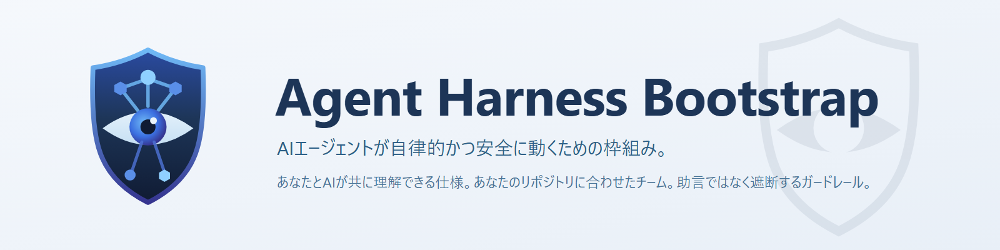
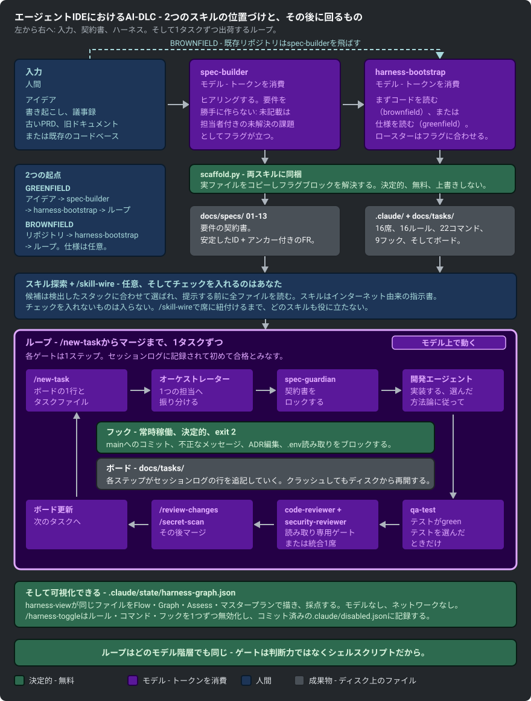

<p align="center">
  
</p>

<p align="center"><b>AIエージェントに、本当に理解できるリポジトリと、抜け出せないハーネスを与える。</b></p>

<p align="center">作者: <a href="https://github.com/nguyenhx2">nguyenhx2</a> · <a href="README.md">English</a> · <b>日本語</b></p>

[](https://github.com/nguyenhx2/agent-harness-bootstrap/actions/workflows/eval.yml) [](LICENSE) [](harness-bootstrap/assets/claude/agents/)
[](eval/guardrail_eval.py) [](https://claude.com/claude-code) [](https://github.com/nguyenhx2/agent-harness-bootstrap/releases/latest)

📊 [スライド資料](https://nguyenhx2.github.io/agent-harness-bootstrap/presentation/) · 🎥 [動画ギャラリー](https://nguyenhx2.github.io/agent-harness-bootstrap/video/) · 📦 [最新リリース](https://github.com/nguyenhx2/agent-harness-bootstrap/releases/latest) · 📚 [ドキュメント一覧](#-ドキュメント一覧)

---

## 🎬 これは何をするか

**Claude Code** のための2つのスキル。管理されていないAIコーディングエージェントに実際によく起きる、
4つの具体的な失敗パターンを直す:

| 導入前 | 導入後 |
|---|---|
| 機能追加をエージェントに頼むと、3モジュールにまたがる14ファイルを編集し、`main` に直push してしまう。 | スコープが絞られたエージェントとパスベースのルールの内側で動く。ブロッキング**フック**(危険な操作を検知して拒否するスクリプト)が、push が届く前に止める。 |
| セッションがコンパクトされると、エージェントは立てていた計画を忘れる。 | タスクボード(`docs/tasks/`)とそのセッションログはコンテキストではなくディスク上にある - 新しいセッションは前回止まった場所からそのまま再開する。 |
| 40番目のエージェント生成ドキュメントが、いつの間にか仕様と矛盾している。 | `spec-builder` が各要件に安定したIDを与え、トレーサビリティグラフ(`docs/context/specs-graph.html`)がズレたドキュメントを検出する。 |
| 「バグを直すだけ」のつもりで `.env`、秘密鍵、`~/.ssh/` を読みにいく。 | それらのパスは読み取りが起きる前に権限レイヤーで拒否される - 開いてよいと許可されていないものは漏らせない。 |

<p align="center">
  <a href="https://nguyenhx2.github.io/agent-harness-bootstrap/video/">
    
  </a>
</p>

<p align="center"><i>プロダクト全体を1本のクリップで。</i> <b><a href="https://nguyenhx2.github.io/agent-harness-bootstrap/video/">ギャラリーで全編を見る</a></b> - クリップ6本、音声なしキャプション付き、ダウンロード不要。</p>

- **[`spec-builder`](spec-builder/)** は、あなたとAIが共に理解できるものを作る - アイデア、書き起こし、
  議事録、あるいは既存の古いドキュメントの山から、安定した要件IDと受け入れ基準を持つ番号付きセクションの
  契約書へと一つの共通言語にまとめ上げる。コア6セクションは常に生成され、残りは入力の内容に応じて
  選択される。要件を勝手に作ることは決してなく、書かれていないことは推測ではなく
  「未解決の課題」として明示的にフラグが立つ。その契約書の具体的な中身は
  [下記](#-spec-builder-が作るもの)を参照。
- **[`harness-bootstrap`](harness-bootstrap/)** は、AIが自律的かつ安全に動作できる枠組みを作る -
  AIが内側で動く `.claude/` **ハーネス**(AIエージェントが何をしてよいかを形作る、エージェント・パスベースの
  ルール・強制スクリプトのフォルダ)で、テンプレートのコピーではなくあなたのリポジトリに合わせて作られる。
  まずあなたのコードを読み込むので、生成される内容は*あなたの*リポジトリに合ったものになる。「合わせて作る」
  の具体的な中身は[手に入るもの](#-手に入るもの)を参照。
- ガードレールはシェルスクリプトと終了コードであり、モデルの判断力に頼らない。すべてのエージェントを
  Opus から Haiku に差し替えても安全の下限は完全に同じ - `python eval/guardrail_eval.py` が証明する、68/68。

<p align="center">
  
</p>

---

## 📋 `spec-builder` が作るもの

毎回ゼロから書き起こすプローズではなく、固定された構造 - `docs/specs/` 配下の番号付きセクションで、
実際のテンプレートファイルから生成されるのでプロジェクトごとに形がぶれない。コア6つ(概要、用語集、
機能要件、非機能要件、改訂履歴、インデックス)は常に存在し、最大8つのオプションセクション
(ステークホルダー、業務フロー、アクセス制御、データモデル、連携、UIワイヤーフレーム、前提、
フィージビリティ)とデザインシステム付録(`14-design-system.md` - デザイントークン `DT-nn`、
コンポーネント一覧 `DS-nn`)は入力の内容に応じて選択される。バックエンドのバッチサービスに
空のワイヤーフレームファイルが生成されることはない:

- **各IDに1つの定義元を持つ、安定した要件ID** - `FR-`(機能要件、セクション05)、`NFR-`(非機能要件、07)、
  `BR-`(業務ルール、05)、`US-`/`UC-`(ユーザーストーリーとユースケース、05)など。他のすべての
  ドキュメントは要件を書き直すのではなく、定義元セクションにリンクバックする。
- **空欄には疑問符ルール** - 不明点が推測された事実になることは決してない。進める前提とするなら
  「前提(`AS-nn`、外れた場合に何が壊れるかを明記)」に、進めないなら「未解決の課題(`OI-nn`、担当者名を
  明記)」として `11-assumptions-constraints.md` に入る - 本物の答えの代わりに推測されたデフォルト値が
  入ることは決してない。
- **検証可能な品質ゲート** - すべてのFRはフィージビリティ表(12)に現れ、少なくとも1つの否定ケースを含む
  受け入れ基準を持ち、ステークホルダーが実際に言ったことに遡れなければならない。ゲートの各チェックは
  ファイルに対するgrepコマンドであり、雰囲気判定ではない。
- **仕様グラフ** - `docs/context/specs-graph.html`。セクション・要件・ADR・タスクが互いをどう参照するかを
  示す自己完結型のインタラクティブなグラフ(ブラウザで開くだけ、サーバー不要)で、孤立したIDも洗い出す。

**生成の拠り所となるドキュメント標準** - 単一標準の認証実装ではなく、意図を持った統合:

- **ISO/IEC/IEEE 29148:2018** - SRSのコンテンツモデルと、要件が満たすべき特性
- **ISO/IEC 25010:2023** - セクション07の PERF/SEC/REL/USE/SCA/MNT カテゴリの背後にあるNFR分類
- **BABOK v3** - 要求の引き出しの規律と要件トレーサビリティ
- **MoSCoW** - Must/Should/Could/Won't の優先度カラム
- **Cockburnユースケース + Gherkin** - UCブロックと Given/When/Then の受け入れ基準
- **C4(コンテキストレベル)+ arc42(コンテキストとスコープ)** - 01の1枚のアーキテクチャ図
- **OWASP ASVS 5.0 + OWASP LLM Top 10(2025)** - セクション07の必須・TBD禁止のセキュリティNFR

どのセクションがどの標準に依拠するか、そして正直な限界も含めた詳細:
[`spec-builder/SKILL.md`](spec-builder/SKILL.md) ·
[`ba-standards.md`](spec-builder/reference/ba-standards.md)。

---

## 🚀 クイックスタート

**Python 3** が必要です。両方のスキルを1行でインストール:

**macOS / Linux**(bash):

```bash
curl -fsSL https://github.com/nguyenhx2/agent-harness-bootstrap/releases/latest/download/agent-harness-bootstrap.zip -o skills.zip \
  && unzip -o skills.zip -d ~/.claude/skills/ \
  && rm skills.zip
```

**Windows**(PowerShell):

```powershell
irm https://github.com/nguyenhx2/agent-harness-bootstrap/releases/latest/download/agent-harness-bootstrap.zip -OutFile "$env:TEMP\skills.zip"
Expand-Archive "$env:TEMP\skills.zip" "$env:USERPROFILE\.claude\skills" -Force
Remove-Item "$env:TEMP\skills.zip"
```

**エージェントにインストールさせる** - Claude Code のセッションに貼り付け:

```text
https://github.com/nguyenhx2/agent-harness-bootstrap の最新リリースから
agent-harness-bootstrap.zip をダウンロードし、同じリリースの SHA256SUMS で検証したうえで、
各スキルディレクトリ(harness-bootstrap/、spec-builder/)が ~/.claude/skills/ 直下に来るよう
展開してください。両方の SKILL.md の存在を確認し、VERSION ファイルのバージョンを報告してください。
```

続けて Claude Code の中で:

```text
/spec-builder           # アイデアから始めるなら、まず仕様を書く
/harness-bootstrap      # このリポジトリの .claude ハーネスを構築(または更新)する
```

すでにコードがあるリポジトリなら `/harness-bootstrap` 単体で実行する - まずコードを読み込み、
見つけた内容でインテイクを事前に埋めてくれる。既存ファイルは**上書きせず、突き合わせて調整**する:
競合があれば報告され、手でマージするために残される。あなたが承認するまで何も書き込まれない。

**スキルを1つだけ、バージョン固定、チェックサム検証、ソースからのインストール、あるいは Claude Code の
代わりに Cursor や Codex でハーネスを動かす方法:** [`docs/tools/`](docs/tools/) を参照 -
[Claude Code](docs/tools/claude-code.md) · [Cursor](docs/tools/cursor.md) · [Codex](docs/tools/codex.md)。

---

## 📦 手に入るもの

固定のバンドルではなく、**このリポジトリに合わせて作られる** `.claude/` ハーネス。ロースター、
読み込まれるルール、フックの種類、拒否リスト、デリバリーの規律はすべて、テンプレートのコピーではなく
インテイクの回答とコードグラフがソースから見つけたものから導かれる:

- **エージェントのロースター** - コードグラフがマッピングしたモジュール/境界づけられたコンテキスト1つに
  つき開発シート1つ。固定人数ではない。あとから `/harness-update` でシートを追加・撤退できる。
- **読み込まれるルール** - マニフェストが示す実際のスタックに一致するものだけ。使っていない言語・
  フレームワーク・関心事(DBなし、UIなし)のルールはそもそも読み込まれない。
- **フック** - インテイクが検出する開発OS(Windows か POSIX か)に一致するもの。誤った種類だと
  ガードレールが静かに何もしないまま素通りしてしまうので、これが合っていることが前提になる。
- **拒否リスト** - このスタックの実際の破壊的コマンド(DBリセットコマンド、デプロイコマンド、
  インフラの撤去コマンド)に一致するもの - あなたの設定から確認したものであり、推測ではない。
- **方法論** - インテイクで選ぶ4つの選択肢: デフォルトはDDD(ドメイン境界のスコープ、実装と同じ変更で
  テストを出荷)、TDD(テストを厳密に先に書く - より強い証明だが遅い)、TDD+DDD(両方を採用する
  もっとも厳格で遅い姿勢 - 2つが引っ張り合うこともある)、または Lightweight(方法論ルールを
  導入しない - レビューゲートとガードレールのフックはそのまま残る。プロトタイプや一人での
  高速な開発向け) - 詳細は [`intake.md`](harness-bootstrap/reference/intake.md)。
- **テスト** - 前提ではなく選択: unit+e2e / unit のみ / e2e のみ / なし、の4通り。選んだ種類だけ
  `qa-test`・`/test`・`rules/testing.md` が出荷される。フレームワークはスタックごとに提案され
  (Vitest はJS/TSスタックにのみ提案される)。
- **エフォートプロファイル** - Default / Economy / Thorough。レビューや安全ゲートに触れずに
  シートごとのコストと深さを調整する。
- **コントロールレベル** - デプロイ権限と破壊的コマンドへの姿勢。デプロイはデフォルトで人間のみ
  (`deploy` はインテイク、または後からの `/harness-tune` が明示的に `ask` へ動かすまで
  `permissions.deny` に留まる)で、インテイクをやり直さずブートストラップ後に調整できる。

```text
.claude/
  agents/     コードグラフが見つけたモジュール1つにつきシート1つ - model / effort / tool grant / turn limit
  rules/      常時読み込みのコアに加え、該当ファイルを触ったときだけ読み込むスタック一致のルール
  commands/   チューニングコマンド(下記)に加え、インテイクが配線するスタック固有のコマンド
  hooks/      あなたのOSに一致したガードレール。危険な操作を実行される前にブロックする
  settings.json
docs/
  tasks/      タスクボード: タスク1件につき1行、エージェントが作業しながら書くセッションログ
  context/    code-graph.md(依存関係マップ)と docs-graph.md(トレーサビリティマップ)。どちらも
              自己完結型のインタラクティブHTMLとして書き出される - docs/context/harness-graph.html
              (エージェント・フック・ルール・コマンド・設定・モジュール)と
              docs/context/specs-graph.html(ドキュメントのトレーサビリティ)
  specs/ requirements/ architecture/ templates/
AGENTS.md + CLAUDE.md
```

| エージェントが試みること | 結果 |
|---|---|
| `.env`、秘密鍵、`~/.ssh/`、Restricted に分類したパスの読み取り | ブロック |
| `main` への直接コミット、AI帰属トレーラー付きコミット | ブロック |
| Accepted な ADR の編集、ロスター外エージェントの起動 | ブロック |

起動境界そのもの - ロスターのシートだけが起動でき、固定されたモデルでしか動かせない - は
`guard-agent-spawn` フックが強制するものであり、エージェントが逸脱しうるルールではない。

この「合わせて作る」が引き出す元になっている出荷済みツールボックス - 資産の全体集合であり、
プロジェクトごとの保証ではない: 16個のエージェント、15個のルール、22個のスラッシュコマンド、
9個のフック。デフォルトのインストールで実際に入るのはおおむね8〜10個。`long` プロジェクトなら
`brainstormer` + `tech-researcher` + `history-tracker` が加わり、`tests` なら `qa-test` が加わり、
`solo_review` なら分割されたレビューアの代わりに統合された `reviewer` 1つに置き換わる。実際に
`.claude/` に入るものは上記の各観点次第 - 全シート一覧は
[`roster.md`](harness-bootstrap/reference/roster.md) を参照。

保証の全リスト、メモリモデル、コストの内訳: [`docs/ASSESSMENT.md`](docs/ASSESSMENT.md)、
[`docs/CONTEXT-MANAGEMENT.md`](docs/CONTEXT-MANAGEMENT.md)、
[`cost-model.md`](harness-bootstrap/reference/cost-model.md)。

### 🔭 `harness-view` - 任意のネイティブビューア

スキル本体が出力するHTML(`docs/context/harness-graph.html`)はPythonとブラウザだけで動き、
これが標準のままである。[`tools/harness-view`](tools/harness-view/) はその上位版 - 同じ
`.claude/state/harness-graph.json` を読む小さなRustバイナリで、リアルタイム更新のUI、
ファイル監視、安全なランタイム切り替えを追加する。欲しい場合だけ導入すればよい。

```
cargo install --path tools/harness-view
```

- `harness-view scan [path]` - `.claude/state/harness-graph.json` を書き出す(スキルのPython製
  スキャナと同じスキーマ)。
- `harness-view serve [path]` - 同じグラフを2通りに表示するローカルWeb UI: 階層表示の **Flow**
  ビューと力学モデルの **Graph** ビュー、さらに `/harness-toggle` と同じHARD/SOFTの安全階層で
  ルール・コマンド・フックを無効化/有効化できる詳細パネル。
- `harness-view watch [path]` - `.claude/` や `docs/` の変更を検知してグラフを自動的に再構築する。

完全に任意である。ハーネス側は何も要求せず、同梱のHTMLビューアが同じ2つのビューをインストール
不要で提供する。

---

## 🎛️ ブートストラップ後のチューニング

ハーネスの初期設定は固定ではない。ブートストラップ後にそれを調整するための8個のコマンドが、
ブートストラップされたすべてのリポジトリに同梱される - 完全なガイド、実例、それぞれが強制する
不変条件は [`docs/TUNING.md`](docs/TUNING.md) にある。

| コマンド | 何をするか |
|---|---|
| [`/board-audit`](docs/TUNING.md#board-audit) | まず `board-check.py` を実行し、そのうえで孤立したタスク、記録されていない実行、ボードのずれ、古くなったコードグラフを読み取り専用で調べる |
| [`/harness-tune`](docs/TUNING.md#harness-tune) | 制御レベルを再調整 - デプロイ権限、破壊的コマンドの扱い、起動許可リスト、上限値、レビュー範囲、エージェント履歴の詳細度(合計6つのダイヤル) |
| [`/harness-toggle`](docs/TUNING.md#harness-toggle) | ルール・コマンド・フックを1つ単位で無効化/再有効化する - HARD項目は確認フレーズの入力、SOFT項目は `--yes` が必要で、エージェントは対象外 |
| [`/agent-permissions`](docs/TUNING.md#agent-permissions) | 1つのシートに1つのツールを付与・剥奪する |
| [`/harness-update`](docs/TUNING.md#harness-update) | 新しいアセットや変わったコードベースを取り込むためスキャフォルダを再実行。競合はフラグ付け、上書きは絶対にしない |
| [`/code-graph`](docs/TUNING.md#code-graph) | コードの依存関係グラフ(mermaid + JSON)を再構築し、ハーネスグラフとHTML出力も更新する。モジュールをまたぐ変更の前にエージェントが参照する |
| [`/docs-graph`](docs/TUNING.md#docs-graph) | ドキュメントのトレーサビリティグラフ(孤立した要件ID)を再構築し、`specs-graph.html` と `harness-graph.html` の両方のインタラクティブ出力を更新する |
| [`/spec-ingest`](docs/TUNING.md#the-spec-side) | 新しい情報源を既存のスペックに取り込む。差分を突き合わせ、改訂履歴に記録し、依存するエージェント定義まで反映する |
| [`/spec-retract`](docs/TUNING.md#the-spec-side) | 誤った情報源や記述を撤回する。影響範囲を追跡し、未確認事項に変換し、該当タスクは人間の判断待ちとしてブロックする |
| [`/skill-wire`](docs/TUNING.md#skill-wire) | インストール済みの [skills.sh](https://www.skills.sh/) スキルをロースターの担当席に配線する。内容の再レビューとスコープ確認のうえ記録される |

確認しても8つのどれも決してしないこと: レビューア系エージェントが書き込み権限を得ることはなく、
起動できるのはオーケストレーターだけであり、コードレビューのゲートは削除できない(範囲の変更のみ可能)。

---

## 🗺️ ドキュメント一覧

| | |
|---|---|
| [`docs/FLOWS.md`](docs/FLOWS.md) | 7つの図: スキャフォルダ、機能追加の一連の流れ、コンテキストの読み込み |
| [`docs/CONTEXT-MANAGEMENT.md`](docs/CONTEXT-MANAGEMENT.md) | RAM とディスク、クラッシュからの再開プロトコル、ハード制御とソフト制御の違い |
| [`docs/ASSESSMENT.md`](docs/ASSESSMENT.md) | スコアカード。できないことも含む |
| [`docs/TUNING.md`](docs/TUNING.md) | ブートストラップ後の8個のチューニングコマンドの完全版 |
| [`docs/QUESTIONNAIRES.md`](docs/QUESTIONNAIRES.md) | 各スキルの質問セットが何を探るか、なぜ重要か - 両スキルのフロー図付き |
| [`docs/RELEASING.md`](docs/RELEASING.md) | セマンティックバージョニング、成果物、リリースノートの書式 |
| [`CONTRIBUTING.md`](CONTRIBUTING.md) | 開発環境のセットアップ、PRが通るべきゲート、アセット編集のルール |
| [スライド資料](https://nguyenhx2.github.io/agent-harness-bootstrap/presentation/) | EN / VI / JP |
| [動画ギャラリー](https://nguyenhx2.github.io/agent-harness-bootstrap/video/) | クリップ6本、音声なしキャプション付き、ダウンロード不要 |
| [`roster.md`](harness-bootstrap/reference/roster.md) | 各エージェントの model / effort / tools / turn limit とその理由 |
| [`cost-model.md`](harness-bootstrap/reference/cost-model.md) | model・effort・tools・キャッシュの安定性が費用にどう影響するか |
| [`task-control.md`](harness-bootstrap/reference/task-control.md) | オーケストレーションのループ、クラッシュからの復旧、マージの規律 |
| [`ba-standards.md`](spec-builder/reference/ba-standards.md) | 仕様セクションが依拠する標準 |
| [`benchmark/RESULTS.md`](benchmark/RESULTS.md) | ベンチマークの数値とその注意点 |

**数値**は、本プロジェクトが置き換える旧スキルとの比較で計測 - `python benchmark/benchmark.py` で再現可能:

| | 導入前 | 導入後 | 差分 |
|---|---:|---:|---:|
| リポジトリをブートストラップするためにモデルが読むバイト数 | 234,196 | 129,638 | **-45%** |
| モデルが出力として書くバイト数 | 95,064 | 13,881 | **-85%** |
| デフォルトのセッションから除外されるルール内容 | - | 52,131 of 79,936 B | **65%** |
| ガードレール評価 | - | **68/68** | - |

---

## 👤 作者について

[**nguyenhx2**](https://github.com/nguyenhx2) が作成。コントリビューション歓迎 -
まずは [`CONTRIBUTING.md`](CONTRIBUTING.md) から。

## 📄 ライセンス

MIT - [LICENSE](LICENSE) を参照。
