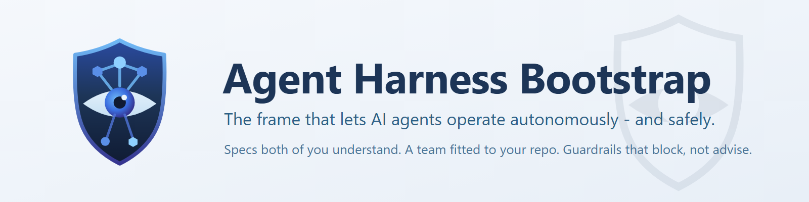
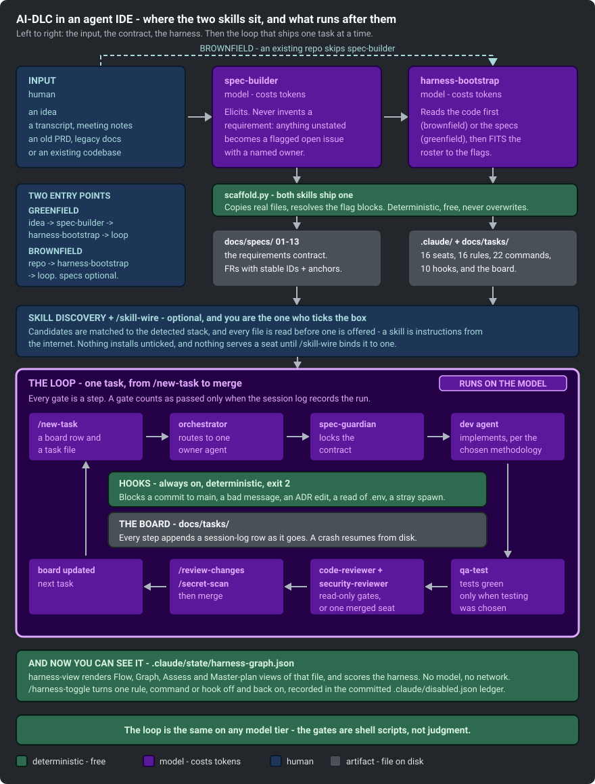

<p align="center">
  
</p>

<p align="center"><b>Give an AI agent a repo it can actually understand, and a harness it cannot escape.</b></p>

<p align="center">by <a href="https://github.com/nguyenhx2">nguyenhx2</a> · <b>English</b> · <a href="README.ja.md">日本語</a></p>

[](https://github.com/nguyenhx2/agent-harness-bootstrap/actions/workflows/eval.yml) [](LICENSE) [](harness-bootstrap/assets/claude/agents/)
[](eval/guardrail_eval.py) [](https://claude.com/claude-code) [](https://github.com/nguyenhx2/agent-harness-bootstrap/releases/latest)

📊 [Slide presentation](https://nguyenhx2.github.io/agent-harness-bootstrap/presentation/) · 🎥 [Video gallery](https://nguyenhx2.github.io/agent-harness-bootstrap/video/) · 📦 [Latest release](https://github.com/nguyenhx2/agent-harness-bootstrap/releases/latest) · 📚 [Docs map](#-docs-map)

---

## 🎬 What it does

Two skills for **Claude Code** that fix four specific, recognizable failure modes of an unmanaged AI
coding agent:

| Before | After |
|---|---|
| You ask an agent for a feature. It edits 14 files across 3 modules and force-pushes to `main`. | It works inside scoped agents and path-based rules; a blocking **hook** (a script that intercepts a risky action and refuses it) stops the push before it lands. |
| The session compacts and the agent forgets the plan it was three steps into. | The task board (`docs/tasks/`) and its session log live on disk, not in context - a fresh session resumes exactly where the last one stopped. |
| The 40th agent-generated doc quietly contradicts what the spec says. | `spec-builder` gives every requirement a stable ID; the traceability graph (`docs/context/specs-graph.html`) flags the doc that drifted. |
| It reads `.env`, a private key, or `~/.ssh/` while "just fixing a bug." | Those paths are denied at the permission layer before the read happens - it cannot leak what it was never allowed to open. |

<p align="center">
  <a href="https://nguyenhx2.github.io/agent-harness-bootstrap/video/">
    
  </a>
</p>

<p align="center"><i>The whole product in one clip.</i> <b><a href="https://nguyenhx2.github.io/agent-harness-bootstrap/video/">Watch the full set in the gallery</a></b> - six clips, sound-free captions, no download.</p>

- **[`spec-builder`](spec-builder/)** creates the thing you and the AI both understand - one shared
  voice, built from an idea, a transcript, meeting notes, or a pile of legacy docs, into a contract
  of numbered sections with stable requirement IDs and acceptance criteria - the core six always,
  the rest selected by what your input actually contains. It never invents a requirement; anything
  unstated becomes a flagged open issue instead of a guess. What that contract actually looks
  like: see [below](#-what-spec-builder-produces).
- **[`harness-bootstrap`](harness-bootstrap/)** creates the frame that lets AI operate autonomously
  AND safely - the `.claude/` **harness** (a folder of agents, path-based rules, and enforcement
  scripts that shapes what an AI agent may do) it runs inside, tailored to your repo rather than
  copied from a template. It reads your code first, so what it generates fits *your* repo. What
  "tailored" means concretely: see [What you get](#-what-you-get).
- The guardrails are shell scripts and exit codes, not the model's judgment. Swap every agent from
  Opus to Haiku and the safety floor is byte-identical - `python eval/guardrail_eval.py` proves it,
  68/68.

<p align="center">
  
</p>

---

## 📋 What `spec-builder` produces

Not prose retyped from scratch each time - a fixed structure of numbered sections under
`docs/specs/`, installed from real template files so the shape never drifts between projects. The
core six (overview, glossary, functional requirements, NFRs, revision history, plus the index)
always exist; up to eight optional sections (stakeholders, business flows, access control, data
model, integrations, UI wireframes, assumptions, feasibility) and a design-system appendix
(`14-design-system.md` - design tokens `DT-nn`, component inventory `DS-nn`) are selected by what
the input material actually contains, so a backend batch service never ships an empty wireframes
file:

- **Stable requirement IDs, each with one defining home** - `FR-` (functional requirements, section
  05), `NFR-` (non-functional, 07), `BR-` (business rules, 05), `US-`/`UC-` (user stories and use
  cases, 05), and more. Every other document links back to the defining section instead of restating
  the requirement.
- **The blank-cell-with-question rule** - an unknown never becomes an invented fact. It becomes either
  an assumption (`AS-nn`, with what breaks if it's wrong) or an open issue (`OI-nn`, with a named
  owner) in `11-assumptions-constraints.md` - never a guessed default standing in for a real answer.
- **A verifiable quality gate** - every FR must appear in the feasibility table (12), carry an
  acceptance criterion with at least one negative case, and trace back to something a stakeholder
  actually said. Each check in the gate is a grep command against the files, not a vibe check.
- **The specs graph** - `docs/context/specs-graph.html`, a self-contained interactive export (open in
  any browser, no server needed) of how sections, requirements, ADRs, and tasks reference each other,
  with orphan IDs called out.

**Document standards it generates against** - an opinionated synthesis, not a certified
implementation:

- **ISO/IEC/IEEE 29148:2018** - the SRS content model and what makes a requirement well-formed
- **ISO/IEC 25010:2023** - the NFR taxonomy behind section 07's PERF/SEC/REL/USE/SCA/MNT categories
- **BABOK v3** - elicitation discipline and requirements traceability
- **MoSCoW** - the Must/Should/Could/Won't priority column
- **Cockburn use cases + Gherkin** - the UC blocks and Given/When/Then acceptance criteria
- **C4 (context level) + arc42 (context and scope)** - the one architecture diagram in 01
- **OWASP ASVS 5.0 + OWASP LLM Top 10 (2025)** - section 07's mandatory, never-TBD security NFRs

Full depth, including which section draws on which standard and the honest limits:
[`spec-builder/SKILL.md`](spec-builder/SKILL.md) ·
[`ba-standards.md`](spec-builder/reference/ba-standards.md).

---

## 🚀 Quickstart

Requires **Python 3**. Install both skills in one line.

**macOS / Linux** (bash):

```bash
curl -fsSL https://github.com/nguyenhx2/agent-harness-bootstrap/releases/latest/download/agent-harness-bootstrap.zip -o skills.zip \
  && unzip -o skills.zip -d ~/.claude/skills/ \
  && rm skills.zip
```

**Windows** (PowerShell):

```powershell
irm https://github.com/nguyenhx2/agent-harness-bootstrap/releases/latest/download/agent-harness-bootstrap.zip -OutFile "$env:TEMP\skills.zip"
Expand-Archive "$env:TEMP\skills.zip" "$env:USERPROFILE\.claude\skills" -Force
Remove-Item "$env:TEMP\skills.zip"
```

**Or let the agent install it** - paste this into any Claude Code session:

```text
Install the two skills from the latest release of
https://github.com/nguyenhx2/agent-harness-bootstrap into ~/.claude/skills/:
download agent-harness-bootstrap.zip from the latest release, verify it against the
SHA256SUMS asset from the same release, extract it so that each skill directory
(harness-bootstrap/, spec-builder/) sits directly under ~/.claude/skills/, confirm both
SKILL.md files exist, and tell me the installed version from their VERSION files.
```

Then, inside Claude Code:

```text
/spec-builder           # write the specs first, if you're starting from an idea
/harness-bootstrap      # build (or update) the .claude harness for this repo
```

If the repo already has code, run `/harness-bootstrap` on its own - it reads the code first and
pre-fills the intake with what it found. Existing files are **reconciled, not overwritten**: anything
that conflicts is reported and left for you to merge. Nothing is written until you approve the plan.

**One skill at a time, a pinned version, checksums, from source, or running the harness in Cursor and
Codex instead of Claude Code:** see [`docs/tools/`](docs/tools/) -
[Claude Code](docs/tools/claude-code.md) · [Cursor](docs/tools/cursor.md) · [Codex](docs/tools/codex.md).

---

## 📦 What you get

Not a fixed bundle - a `.claude/` harness **tailored to this repo**. The roster, which rules load, the
hook flavor, the deny-list, and the delivery discipline are all derived from intake and from what the
code graph finds in your source, not copied from a template:

- **Agent roster** - one dev seat per module or bounded context the code graph maps in your repo, not
  a fixed head count; add or retire a seat later with `/harness-update`.
- **Rules that load** - matched to the stack your manifests actually show; a rule for a language,
  framework, or concern you don't have (no DB, no UI) never loads at all.
- **Hooks** - matched to the dev OS intake detects (Windows vs. POSIX), so the guardrails fire instead
  of silently no-opping on the wrong shell.
- **Deny-list** - matched to the real destructive commands for this stack (the DB reset command, the
  deploy command, any infra-teardown command) - confirmed from your config, never guessed.
- **Methodology** - four options, chosen in intake: DDD by default (bounded-context scopes, tests ship
  with the implementation), TDD (tests strictly first - stronger proof, slower delivery), TDD+DDD (both,
  the strictest and slowest posture - the two can pull against each other), or Lightweight (no
  methodology rule installed, the review gate and guardrail hooks stay - for prototypes and solo
  velocity) - see [`intake.md`](harness-bootstrap/reference/intake.md).
- **Testing** - a choice, not an assumption: unit + e2e, unit only, e2e only, or none. Only the chosen
  kinds ship `qa-test`, `/test`, and `rules/testing.md`; frameworks are then suggested per stack
  (Vitest is only suggested for JS/TS).
- **Effort profile** - Default / Economy / Thorough, tuning cost vs. depth per seat without touching a
  review or safety gate.
- **Control level** - deploy rights and destructive-command posture; deployment defaults to
  human-only (`deploy` sits in `permissions.deny` until intake, or `/harness-tune` later, moves it to
  `ask`), adjustable after bootstrap without re-running intake.

```text
.claude/
  agents/     one seat per module the code graph finds - model, effort, tool grant, turn limit
  rules/      always-loaded core plus stack-matched rules that load only on a matching file touched
  commands/   the tuning commands (below) plus the stack-specific ones intake wires in
  hooks/      the guardrails matched to your OS, blocking a dangerous action before it happens
  settings.json
docs/
  tasks/      the board: one row per task, a session log the agent writes AS IT WORKS
  context/    code-graph.md (dependency map) and docs-graph.md (traceability map), each also exported
              as self-contained interactive HTML - docs/context/harness-graph.html (agents, hooks,
              rules, commands, settings, and modules) and docs/context/specs-graph.html (document
              traceability)
  specs/ requirements/ architecture/ templates/
AGENTS.md + CLAUDE.md
```

| An agent tries to | Result |
|---|---|
| Read `.env`, a private key, `~/.ssh/`, or a path classified Restricted | Blocked |
| Commit straight to `main`, or ship an AI-attribution trailer | Blocked |
| Edit an Accepted ADR, or spawn an off-roster agent | Blocked |

The spawn boundary itself - only a roster seat may run, and only at its pinned model - is enforced by
the `guard-agent-spawn` hook, not by a rule an agent could drift from.

Shipped toolbox this tailoring draws from - the asset superset, not a per-project guarantee: 16
agents, 15 rules, 22 slash commands, 9 hooks. Roughly 8-10 agents land in a default install; a `long`
project adds `brainstormer` + `tech-researcher` + `history-tracker`, `tests` adds `qa-test`, and
`solo_review` swaps the split reviewers for one merged `reviewer`. What actually lands in your
`.claude/` depends on the dimensions above; see [`roster.md`](harness-bootstrap/reference/roster.md)
for the full seat list.

Full guarantees, the memory model, and the cost breakdown: [`docs/ASSESSMENT.md`](docs/ASSESSMENT.md),
[`docs/CONTEXT-MANAGEMENT.md`](docs/CONTEXT-MANAGEMENT.md),
[`cost-model.md`](harness-bootstrap/reference/cost-model.md).

### 🔭 `harness-view` - the optional native viewer

The skill's own HTML export (`docs/context/harness-graph.html`) needs nothing but Python and a
browser, and that stays the default. [`tools/harness-view`](tools/harness-view/) is the power
version: a small Rust binary that reads the same `.claude/state/harness-graph.json` contract and
adds a live-refreshing UI, file watching, and safe runtime toggles - install it only if you want
those.

```
cargo install --path tools/harness-view
```

- `harness-view scan [path]` - write `.claude/state/harness-graph.json` (same schema the skill's
  Python scanner writes).
- `harness-view serve [path]` - a local web UI with two views of the same graph: layered **Flow**
  and force-directed **Graph**, plus a details panel that can disable/enable rules, commands, and
  hooks under the same HARD/SOFT safety tiers as `/harness-toggle`.
- `harness-view watch [path]` - rebuild the graph automatically on `.claude/` or `docs/` changes.

It is entirely optional: nothing in the harness requires it, and the shipped HTML viewer covers the
same two views with zero install.

---

## 🎛️ Post-bootstrap tuning

The harness's starting posture is not permanent. Eight commands ship into every bootstrapped repo to
adjust it after the fact - full guidance, worked examples, and the invariants each one enforces live
in [`docs/TUNING.md`](docs/TUNING.md).

| Command | What it does |
|---|---|
| [`/board-audit`](docs/TUNING.md#board-audit) | Runs `board-check.py` first, then a read-only sweep for orphaned tasks, unlogged runs, board drift, and a stale code graph |
| [`/harness-tune`](docs/TUNING.md#harness-tune) | Retune control level - deploy rights, destructive-command posture, spawn allowlist, caps, review scope, agent-history detail (six dials) |
| [`/harness-toggle`](docs/TUNING.md#harness-toggle) | Disable or re-enable one rule, command, or hook - HARD items need a typed confirm phrase, SOFT items need `--yes`, agents are refused |
| [`/agent-permissions`](docs/TUNING.md#agent-permissions) | Grant or revoke one tool on one roster seat |
| [`/harness-update`](docs/TUNING.md#harness-update) | Re-run the scaffolder to pick up new assets or a changed codebase, conflicts flagged, never clobbered |
| [`/code-graph`](docs/TUNING.md#code-graph) | Rebuild the code dependency graph (mermaid + JSON) an agent consults before a cross-module change, and refresh the harness graph + HTML exports |
| [`/docs-graph`](docs/TUNING.md#docs-graph) | Rebuild the docs traceability graph - orphan requirement IDs - and refresh both interactive exports, `specs-graph.html` and `harness-graph.html` |
| [`/spec-ingest`](docs/TUNING.md#the-spec-side) | Fold a new source into an existing spec set - diffed, versioned, rippled to the agent files that depend on it |
| [`/spec-retract`](docs/TUNING.md#the-spec-side) | Withdraw a bad source or claim - traced, converted to open issues, affected tasks blocked for a human |
| [`/skill-wire`](docs/TUNING.md#skill-wire) | Wire an installed [skills.sh](https://www.skills.sh/) skill to a roster seat - content re-review, scope match, recorded |

Three things none of the eight will ever do, no matter what you confirm:
reviewers never gain write access, only the orchestrator spawns, and the code-review gate cannot be
removed - only rescoped.

---

## 🗺️ Docs map

| | |
|---|---|
| [`docs/FLOWS.md`](docs/FLOWS.md) | Seven diagrams: the scaffolder, one feature end to end, context loading |
| [`docs/CONTEXT-MANAGEMENT.md`](docs/CONTEXT-MANAGEMENT.md) | RAM vs. disk, the crash-resume protocol, hard vs. soft controls |
| [`docs/ASSESSMENT.md`](docs/ASSESSMENT.md) | Scorecard, including what this does not do |
| [`docs/TUNING.md`](docs/TUNING.md) | The eight post-bootstrap tuning commands, in full |
| [`docs/QUESTIONNAIRES.md`](docs/QUESTIONNAIRES.md) | What each skill's question set explores, and why - flow diagrams for both |
| [`docs/RELEASING.md`](docs/RELEASING.md) | Semver, artifacts, the release note format |
| [`CONTRIBUTING.md`](CONTRIBUTING.md) | Dev setup, the gates a PR must pass, asset editing rules |
| [Slide presentation](https://nguyenhx2.github.io/agent-harness-bootstrap/presentation/) | EN / VI / JP |
| [Video gallery](https://nguyenhx2.github.io/agent-harness-bootstrap/video/) | Six clips, sound-free captions, no download |
| [`roster.md`](harness-bootstrap/reference/roster.md) | Every agent's model, effort, tools, turn limit, and why |
| [`cost-model.md`](harness-bootstrap/reference/cost-model.md) | How model, effort, tools, and cache stability affect the bill |
| [`task-control.md`](harness-bootstrap/reference/task-control.md) | The orchestration loop, crash recovery, merge discipline |
| [`ba-standards.md`](spec-builder/reference/ba-standards.md) | Which standards the spec sections draw on |
| [`benchmark/RESULTS.md`](benchmark/RESULTS.md) | Benchmark numbers and their caveats |

**Numbers**, measured against the predecessor skill this replaces - reproduce with
`python benchmark/benchmark.py`:

| | Before | After | Δ |
|---|---:|---:|---:|
| Bytes the model must read to bootstrap a repo | 234,196 | 129,638 | **-45%** |
| Bytes the model must write as output | 95,064 | 13,881 | **-85%** |
| Rule content kept out of the default session | - | 52,131 of 79,936 B | **65%** |
| Guardrail eval | - | **68/68** | - |

---

## 👤 Who made this

Built by [**nguyenhx2**](https://github.com/nguyenhx2). Contributions welcome - start with
[`CONTRIBUTING.md`](CONTRIBUTING.md).

## 📄 License

MIT - see [LICENSE](LICENSE).
