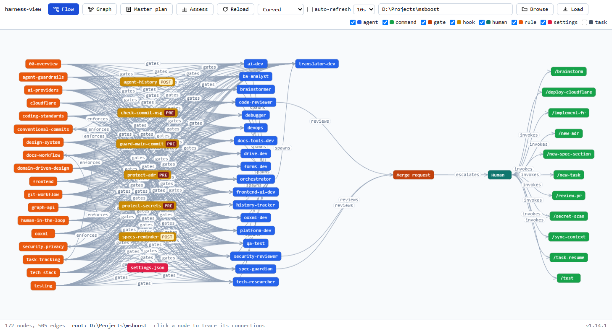
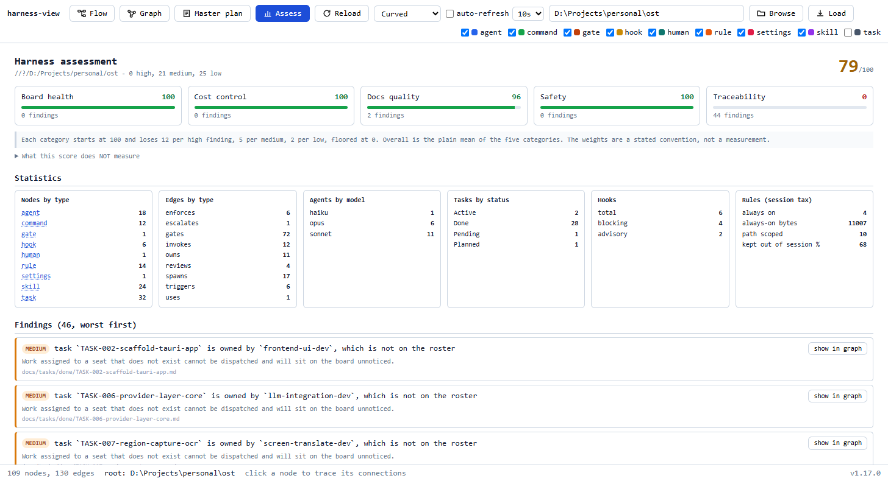

<p align="center">
  
</p>

<p align="center"><b>Give an AI agent a repo it can actually understand, and a harness it cannot escape.</b></p>

<p align="center">by <a href="https://github.com/nguyenhx2">nguyenhx2</a> · <b>English</b> · <a href="README.ja.md">日本語</a></p>

[](https://github.com/nguyenhx2/agent-harness-bootstrap/actions/workflows/eval.yml) [](LICENSE) [](harness-bootstrap/assets/claude/agents/)
[](eval/guardrail_eval.py) [](https://claude.com/claude-code) [](https://github.com/nguyenhx2/agent-harness-bootstrap/releases/latest)

📊 [Slide presentation](https://nguyenhx2.github.io/agent-harness-bootstrap/presentation/) · 🎥 [Video gallery](https://nguyenhx2.github.io/agent-harness-bootstrap/video/) · 📦 [Latest release](https://github.com/nguyenhx2/agent-harness-bootstrap/releases/latest) · 📚 [Docs map](#-docs-map)

---

## 🎬 What it does

Two skills for **Claude Code** that fix four specific, recognizable failure modes of an unmanaged AI
coding agent:

| Before | After |
|---|---|
| You ask an agent for a feature. It edits 14 files across 3 modules and force-pushes to `main`. | It works inside scoped agents and path-based rules; a blocking **hook** (a script that intercepts a risky action and refuses it) stops the push before it lands. |
| The session compacts and the agent forgets the plan it was three steps into. | The task board (`docs/tasks/`) and its session log live on disk, not in context - a fresh session resumes exactly where the last one stopped. |
| The 40th agent-generated doc quietly contradicts what the spec says. | `spec-builder` gives every requirement a stable ID; the traceability graph (`docs/context/specs-graph.html`) flags the doc that drifted. |
| It reads `.env`, a private key, or `~/.ssh/` while "just fixing a bug." | Those paths are denied at the permission layer before the read happens - it cannot leak what it was never allowed to open. |

<p align="center">
  <a href="https://nguyenhx2.github.io/agent-harness-bootstrap/video/">
    
  </a>
</p>

<p align="center"><i>The whole product in one clip.</i> <b><a href="https://nguyenhx2.github.io/agent-harness-bootstrap/video/">Watch the full set in the gallery</a></b> - seven clips, sound-free captions, no download.</p>

- **[`spec-builder`](spec-builder/)** creates the thing you and the AI both understand - one shared
  voice, built from an idea, a transcript, meeting notes, or a pile of legacy docs, into a contract
  of numbered sections with stable requirement IDs and acceptance criteria - the core six always,
  the rest selected by what your input actually contains. It never invents a requirement; anything
  unstated becomes a flagged open issue instead of a guess. What that contract actually looks
  like: see [below](#-what-spec-builder-produces).
- **[`harness-bootstrap`](harness-bootstrap/)** creates the frame that lets AI operate autonomously
  AND safely - the `.claude/` **harness** (a folder of agents, path-based rules, and enforcement
  scripts that shapes what an AI agent may do) it runs inside, tailored to your repo rather than
  copied from a template. It reads your code first, so what it generates fits *your* repo. What
  "tailored" means concretely: see [What you get](#-what-you-get).
- The guardrails are shell scripts and exit codes, not the model's judgment. Swap every agent from
  Opus to Haiku and the safety floor is byte-identical - `python eval/guardrail_eval.py` proves it,
  107/107.

<p align="center">
  
</p>

---

## 🧩 Tailored, not comprehensive

The usual way to ship an agent kit is to ship all of it: every agent, a hundred skills, every rule
and every hook, installed before anyone has read the codebase. It looks generous. What it actually
does is hand you a team you did not pick, for a project it has never seen.

That costs more than it looks like it costs:

- **You pay context for all of it, in every session.** A rule that matches no file in your repo is
  not free. It is a tax on every request, forever.
- **Seats end up with no owner.** An agent nobody routes work to is not capability held in reserve.
  It is a name in a routing table that makes the table harder to read.
- **The advice goes generic.** Guidance written to be true in any repository is rarely specific
  enough to act on in yours.
- **You cannot tell what is load-bearing.** When everything is installed, nothing signals that it
  was chosen, so nobody can safely remove anything.

Completeness gets mistaken for fit. They are not the same thing, and only one of them is worth
paying for.

<p align="center">
  
</p>

### The step in the middle

`spec-builder` ends with a contract. `harness-bootstrap` begins with a codebase. **The step between
them is where the team gets decided**, and it is the step most kits do not have at all.

Both sides are evidence. The contract says what has to be built, in numbered requirements. The
codebase analysis says what is already here: the modules, the stack it detected, the operations that
are dangerous. The roster is derived from those two, and from nothing else:

| Decided from | What it decides |
|---|---|
| The modules that actually exist | One dev agent each, scoped to real paths. No module, no seat. |
| The contract and your answers | Which of the 16 seats are filled. A run installs **7 to 15 of the 16 seats**, never all of them by default. |
| The manifests in your repo | Which skills are even proposed. You choose from that shortlist, and `/skill-wire` connects each one to the agent that will use it. |
| The paths that exist | Which rules are path-scoped, which keeps **63%** of rule content out of the default session. |

The numbers above are measured, not claimed: scaffold with the leanest answers and you get 7 seats;
answer yes to databases, tests and a long-lived project and you get 15. Nothing installs itself, and
`harness-view assess` will name any seat without a module, any rule without a path, and any skill
without an agent.

---

## 🧵 How it all fits together

<p align="center">
  
</p>

A loom is the honest picture. Threads go in tangled and cloth comes out, and nothing about that is
magic: the frame is what makes the difference. Everything inside the blue box is frame.
`spec-builder` sits outside it and does one job, turning whatever you brought (an idea, a
transcript, legacy docs, a bare repo) into one contract written to international standards. Inside,
rules and hooks come down into the agents, state and skills feed in from either side, and what
leaves the waist is the same three things every time, all carrying stable IDs.

The point of the drawing is the colour. Going in, every thread is a different colour and none of
them are parallel. Coming out they are one colour, running the same direction. That is the whole
claim of this repo, and it is a claim about the frame, not about the model.

### Seeing the weave

The harness is not a diagram you take on trust. `harness-view` renders the real thing from
`.claude/state/harness-graph.json`, and every node is a file you can open.

<p align="center">
  
</p>

<p align="center">
  
</p>

Both are a real harness, not a mock-up: 172 nodes, 505 edges, scored 64/100 by the deterministic
assess engine. No model is involved in that score, so a browser and a CI run cannot disagree
about it.

---

## 📋 What `spec-builder` produces

Not prose retyped from scratch each time - a fixed structure of numbered sections under
`docs/specs/`, installed from real template files so the shape never drifts between projects. The
core six (overview, glossary, functional requirements, NFRs, revision history, plus the index)
always exist; up to eight optional sections (stakeholders, business flows, access control, data
model, integrations, UI wireframes, assumptions, feasibility) and a design-system appendix
(`14-design-system.md` - design tokens `DT-nn`, component inventory `DS-nn`) are selected by what
the input material actually contains, so a backend batch service never ships an empty wireframes
file:

- **Stable requirement IDs, each with one defining home** - `FR-` (functional requirements, section
  05), `NFR-` (non-functional, 07), `BR-` (business rules, 05), `US-`/`UC-` (user stories and use
  cases, 05), and more. Every other document links back to the defining section instead of restating
  the requirement.
- **The blank-cell-with-question rule** - an unknown never becomes an invented fact. It becomes either
  an assumption (`AS-nn`, with what breaks if it's wrong) or an open issue (`OI-nn`, with a named
  owner) in `11-assumptions-constraints.md` - never a guessed default standing in for a real answer.
- **A verifiable quality gate** - every FR must appear in the feasibility table (12), carry an
  acceptance criterion with at least one negative case, and trace back to something a stakeholder
  actually said. Each check in the gate is a grep command against the files, not a vibe check.
- **The specs graph** - `docs/context/specs-graph.html`, a self-contained interactive export (open in
  any browser, no server needed) of how sections, requirements, ADRs, and tasks reference each other,
  with orphan IDs called out.

**Document standards it generates against** - an opinionated synthesis, not a certified
implementation:

- **ISO/IEC/IEEE 29148:2018** - the SRS content model and what makes a requirement well-formed
- **ISO/IEC 25010:2023** - the NFR taxonomy behind section 07's PERF/SEC/REL/USE/SCA/MNT categories
- **BABOK v3** - elicitation discipline and requirements traceability
- **MoSCoW** - the Must/Should/Could/Won't priority column
- **Cockburn use cases + Gherkin** - the UC blocks and Given/When/Then acceptance criteria
- **C4 (context level) + arc42 (context and scope)** - the one architecture diagram in 01
- **OWASP ASVS 5.0 + OWASP LLM Top 10 (2025)** - section 07's mandatory, never-TBD security NFRs

Full depth, including which section draws on which standard and the honest limits:
[`spec-builder/SKILL.md`](spec-builder/SKILL.md) ·
[`ba-standards.md`](spec-builder/reference/ba-standards.md).

---

## 🚀 Quickstart

Requires **Python 3**. Install both skills in one line.

**macOS / Linux** (bash):

```bash
curl -fsSL https://github.com/nguyenhx2/agent-harness-bootstrap/releases/latest/download/agent-harness-bootstrap.zip -o skills.zip \
  && unzip -o skills.zip -d ~/.claude/skills/ \
  && rm skills.zip
```

**Windows** (PowerShell):

```powershell
irm https://github.com/nguyenhx2/agent-harness-bootstrap/releases/latest/download/agent-harness-bootstrap.zip -OutFile "$env:TEMP\skills.zip"
Expand-Archive "$env:TEMP\skills.zip" "$env:USERPROFILE\.claude\skills" -Force
Remove-Item "$env:TEMP\skills.zip"
```

**Or let the agent install it** - paste this into any Claude Code session:

```text
Install the two skills from the latest release of
https://github.com/nguyenhx2/agent-harness-bootstrap into ~/.claude/skills/:
download agent-harness-bootstrap.zip from the latest release, verify it against the
SHA256SUMS asset from the same release, extract it so that each skill directory
(harness-bootstrap/, spec-builder/) sits directly under ~/.claude/skills/, confirm both
SKILL.md files exist, and tell me the installed version from their VERSION files.
```

Then, inside Claude Code:

```text
/spec-builder           # write the specs first, if you're starting from an idea
/harness-bootstrap      # build (or update) the .claude harness for this repo
```

If the repo already has code, run `/harness-bootstrap` on its own - it reads the code first and
pre-fills the intake with what it found. Existing files are **reconciled, not overwritten**: anything
that conflicts is reported and left for you to merge. Nothing is written until you approve the plan.

**One skill at a time, a pinned version, checksums, from source, or running the harness in Cursor and
Codex instead of Claude Code:** see [`docs/tools/`](docs/tools/) -
[Claude Code](docs/tools/claude-code.md) · [Cursor](docs/tools/cursor.md) · [Codex](docs/tools/codex.md).

---

## 💬 What you will be asked

Both skills interview you before they write anything, **in the language you write to them in** -
open in Vietnamese and the questions come back in Vietnamese. Closed choices arrive as pick-lists,
batched up to four at a time; open questions stay in chat. Nothing is generated until you approve a
one-screen plan.

**`harness-bootstrap` - eight batches, and most of them are confirmations.** On an existing repo it
reads the code first and pre-fills every answer it can, so you are correcting findings rather than
typing from scratch.

| Batch | Decides | Mostly |
|---|---|---|
| A identity | Name, docs language, whether specs exist, which AI tools must run it | Asked |
| B stack | Language, DB, integrations, environments, authorization, dev OS | Confirmed from the code |
| C git | Platform, commit identity, default branch, commit convention | Confirmed from git |
| D quality and safety | Roster shape, testing, methodology, data sensitivity, effort, control level | Asked |
| E database | Which DB agents, the real reset command | Only if there is a DB |
| F frontend | Brand assets, icon policy, accessibility target | Only if there is UI |
| G audit | Repos in scope, scanners, who fixes | Only in audit mode |
| H governance | Model sovereignty, residency, licences, gated actions | Asked, never defaulted |

Batch H is the one place nothing is ever guessed: each answer is a policy position only your
organisation can hold, and an invented one would be believed. "We do not know yet" is a valid
answer and becomes a registered task.

**In a hurry?** Say so and you get the **express path**: only the questions with no safe default
(project identity, deployment rights, and all of batch H), with every other answer defaulted and
shown to you as one table to confirm. Audit mode is never express - scope cannot be guessed.

**`spec-builder` - four batches plus a setup question.** Setup picks the output language, which
sections to build (the core set is fixed, the rest are offered with the ones your material supports
pre-ticked), and how strict a standards profile to follow. Then: scope, people, data and systems,
constraints. It never invents a requirement - anything unstated becomes a flagged open issue with an
ID, not a guess.

Full question-by-question detail, and why each is asked:
[`docs/QUESTIONNAIRES.md`](docs/QUESTIONNAIRES.md).

---

## 📦 What you get

Not a fixed bundle - a `.claude/` harness **tailored to this repo**. The roster, which rules load, the
hook flavor, the deny-list, and the delivery discipline are all derived from intake and from what the
code graph finds in your source, not copied from a template:

- **Agent roster** - one dev seat per module or bounded context the code graph maps in your repo, not
  a fixed head count; add or retire a seat later with `/harness-update`.
- **Rules that load** - matched to the stack your manifests actually show; a rule for a language,
  framework, or concern you don't have (no DB, no UI) never loads at all.
- **Hooks** - matched to the dev OS intake detects (Windows vs. POSIX), so the guardrails fire instead
  of silently no-opping on the wrong shell.
- **Deny-list** - matched to the real destructive commands for this stack (the DB reset command, the
  deploy command, any infra-teardown command) - confirmed from your config, never guessed.
- **Methodology** - four options, chosen in intake: DDD by default (bounded-context scopes, tests ship
  with the implementation), TDD (tests strictly first - stronger proof, slower delivery), TDD+DDD (both,
  the strictest and slowest posture - the two can pull against each other), or Lightweight (no
  methodology rule installed, the review gate and guardrail hooks stay - for prototypes and solo
  velocity) - see [`intake.md`](harness-bootstrap/reference/intake.md).
- **Testing** - a choice, not an assumption: unit + e2e, unit only, e2e only, or none. Only the chosen
  kinds ship `qa-test`, `/test`, and `rules/testing.md`; frameworks are then suggested per stack
  (Vitest is only suggested for JS/TS).
- **Effort profile** - Default / Economy / Thorough, tuning cost vs. depth per seat without touching a
  review or safety gate.
- **Control level** - deploy rights and destructive-command posture; deployment defaults to
  human-only (`deploy` sits in `permissions.deny` until intake, or `/harness-tune` later, moves it to
  `ask`), adjustable after bootstrap without re-running intake.

```text
.claude/
  agents/     one seat per module the code graph finds - model, effort, tool grant, turn limit
  rules/      always-loaded core plus stack-matched rules that load only on a matching file touched
  commands/   the tuning commands (below) plus the stack-specific ones intake wires in
  hooks/      the guardrails matched to your OS, blocking a dangerous action before it happens
  settings.json
docs/
  tasks/      the board: one row per task, a session log the agent writes AS IT WORKS
  context/    code-graph.md (dependency map) and docs-graph.md (traceability map), each also exported
              as self-contained interactive HTML - docs/context/harness-graph.html (agents, hooks,
              rules, commands, settings, and modules) and docs/context/specs-graph.html (document
              traceability)
  specs/ requirements/ architecture/ templates/
AGENTS.md + CLAUDE.md
```

| An agent tries to | Result |
|---|---|
| Read `.env`, a private key, `~/.ssh/`, or a path classified Restricted | Blocked |
| Commit straight to `main`, or ship an AI-attribution trailer | Blocked |
| Edit an Accepted ADR, or spawn an off-roster agent | Blocked |

The spawn boundary itself - only a roster seat may run, and only at its pinned model - is enforced by
the `guard-agent-spawn` hook, not by a rule an agent could drift from.

Shipped toolbox this tailoring draws from - the asset superset, not a per-project guarantee: 16
agents, 16 rules, 22 slash commands, 10 hooks (9 always; the rtk wrapper only behind its
flag). Roughly 8-10 agents land in a default install; a `long`
project adds `brainstormer` + `tech-researcher` + `history-tracker`, `tests` adds `qa-test`, and
`solo_review` swaps the split reviewers for one merged `reviewer`. What actually lands in your
`.claude/` depends on the dimensions above; see [`roster.md`](harness-bootstrap/reference/roster.md)
for the full seat list.

Full guarantees, the memory model, and the cost breakdown: [`docs/ASSESSMENT.md`](docs/ASSESSMENT.md),
[`docs/CONTEXT-MANAGEMENT.md`](docs/CONTEXT-MANAGEMENT.md),
[`cost-model.md`](harness-bootstrap/reference/cost-model.md).

### 🔭 `harness-view` - the optional native viewer

The skill's own HTML export (`docs/context/harness-graph.html`) needs nothing but Python and a
browser, and that stays the default. [`tools/harness-view`](tools/harness-view/) is the power
version: a small Rust binary that reads the same `.claude/state/harness-graph.json` contract and
adds a live-refreshing UI, file watching, and safe runtime toggles.

Every release attaches a **standalone executable** for Windows, macOS (Intel and Apple Silicon)
and Linux - no toolchain, no Python, no install step. On Windows you can drop it into a repo and
double-click it: with no arguments it serves that folder and opens your browser. Or build from
source with `cargo install --path tools/harness-view`.

```
harness-view                              # serve the current folder, open a browser
harness-view scan  [path]                 # write .claude/state/harness-graph.json
harness-view serve [path] [--port 7420]   # Flow + Graph views, details panel, safe toggles
harness-view watch [path]                 # rebuild the graph as .claude/ or docs/ change
```

Full instructions for every route - downloading per OS, the double-click case, pointing it at
other repos, the endpoints and the safety model - are in
[`tools/harness-view/README.md`](tools/harness-view/README.md).

It is entirely optional: nothing in the harness requires it, and the shipped HTML viewer covers the
same two views with zero install.

---

## 🎛️ Post-bootstrap tuning

The harness's starting posture is not permanent. Eight commands ship into every bootstrapped repo to
adjust it after the fact, plus two more (`/spec-ingest`, `/spec-retract`) that arrive with a
`spec-builder` spec set - full guidance, worked examples, and the invariants each one enforces live
in [`docs/TUNING.md`](docs/TUNING.md).

| Command | What it does |
|---|---|
| [`/board-audit`](docs/TUNING.md#board-audit) | Runs `board-check.py` first, then a read-only sweep for orphaned tasks, unlogged runs, board drift, and a stale code graph |
| [`/harness-tune`](docs/TUNING.md#harness-tune) | Retune control level - deploy rights, destructive-command posture, spawn allowlist, caps, review scope, agent-history detail (six dials) |
| [`/harness-toggle`](docs/TUNING.md#harness-toggle) | Disable or re-enable one rule, command, or hook - HARD items need a typed confirm phrase, SOFT items need `--yes`, agents are refused |
| [`/agent-permissions`](docs/TUNING.md#agent-permissions) | Grant or revoke one tool on one roster seat |
| [`/harness-update`](docs/TUNING.md#harness-update) | Re-run the scaffolder to pick up new assets or a changed codebase, conflicts flagged, never clobbered |
| [`/code-graph`](docs/TUNING.md#code-graph) | Rebuild the code dependency graph (mermaid + JSON) an agent consults before a cross-module change, and refresh the harness graph + HTML exports |
| [`/docs-graph`](docs/TUNING.md#docs-graph) | Rebuild the docs traceability graph - orphan requirement IDs - and refresh both interactive exports, `specs-graph.html` and `harness-graph.html` |
| [`/spec-ingest`](docs/TUNING.md#the-spec-side) | Fold a new source into an existing spec set - diffed, versioned, rippled to the agent files that depend on it |
| [`/spec-retract`](docs/TUNING.md#the-spec-side) | Withdraw a bad source or claim - traced, converted to open issues, affected tasks blocked for a human |
| [`/skill-wire`](docs/TUNING.md#skill-wire) | Wire an installed [skills.sh](https://www.skills.sh/) skill to a roster seat - content re-review, scope match, recorded |

Three things none of the eight will ever do, no matter what you confirm:
reviewers never gain write access, only the orchestrator spawns, and the code-review gate cannot be
removed - only rescoped.

---

## 🛠️ Delivery commands

A second set of commands runs during normal feature work rather than harness upkeep - registering a
task, implementing an FR, running tests, reviewing a diff, deploying. Full reference, including what
each writes and refuses: [`docs/FLOWS.md` section 7](docs/FLOWS.md#7-delivery-commands-command-by-command).

| Command | What it does | Ships |
|---|---|---|
| [`/new-task`](docs/FLOWS.md#new-task-short-title) | Create a task file from the template, register it on the master plan | Unconditional |
| [`/implement-fr`](docs/FLOWS.md#implement-fr-fr-id) | Plan and implement a functional requirement end-to-end against its acceptance criteria | Unconditional |
| [`/scaffold-feature`](docs/FLOWS.md#scaffold-feature-feature-slug) | Create a feature's skeleton - entry point, module, component, failing test - no logic | Unconditional |
| [`/db-migration`](docs/FLOWS.md#db-migration-migration-name) | Generate a migration against the local DB only, escalating anything that could lose data | `db` |
| [`/seed-db`](docs/FLOWS.md#seed-db) | Seed the local/dev database with deterministic, synthetic, idempotent data | `db` + `db_seeder` |
| [`/test`](docs/FLOWS.md#test) | Run lint plus the unit/e2e suites, report failures by owning agent | `tests` |
| [`/review-changes`](docs/FLOWS.md#review-changes) | Code + security review on the current diff before a PR/MR - never merges or deploys | Unconditional |
| [`/secret-scan`](docs/FLOWS.md#secret-scan) | Scan the diff for secrets and sensitive data - any hit blocks until rotated | Unconditional |
| [`/deploy`](docs/FLOWS.md#deploy) | Deploy after every precondition holds - human-invoked only, never model-triggered | Unconditional |
| [`/new-adr`](docs/FLOWS.md#new-adr-decision-title) | Create an Architecture Decision Record - Accepted ADRs are hook-immutable | Unconditional |
| [`/new-spec-section`](docs/FLOWS.md#new-spec-section-section-number-or-name) | Scaffold a missing `docs/specs/` section | Unconditional |
| [`/sync-context`](docs/FLOWS.md#sync-context) | Refresh `docs/context/` (rules, issues, changelog, glossary) from what landed | Unconditional |
| [`/task-resume`](docs/FLOWS.md#task-resume-task-nnn) | Resume a task after a compaction or crash, trusting files over memory | Unconditional |
| [`/brainstorm`](docs/FLOWS.md#brainstorm-topic) | Structured options + trade-offs on a decision, never deciding for the user | `long` |
| [`/security-scan`](docs/FLOWS.md#security-scan-repo-slug) | Run the pinned scanner suite (read-only mount) and record new findings | `audit` mode only |
| [`/triage-findings`](docs/FLOWS.md#triage-findings-repo-slug) | Confirm, score, anchor, and register findings as tasks - never applies the fix | `audit` mode only |

---

## 🗺️ Docs map

```text
agent-harness-bootstrap
├── docs/                          how it works, and what it costs
│   ├── FLOWS.md                   seven diagrams + the delivery-command reference
│   ├── CONTEXT-MANAGEMENT.md      RAM vs disk, crash-resume, hard vs soft controls
│   ├── QUESTIONNAIRES.md          what each skill asks, and why - flow diagrams for both
│   ├── TUNING.md                  the eight tuning commands + spec-builder's ingest/retract pair
│   ├── ASSESSMENT.md              scorecard, including what this does not do
│   └── RELEASING.md               semver, artifacts, the release-note format
│
├── harness-bootstrap/             skill 1 - builds the harness
│   ├── SKILL.md                   the procedure the model follows
│   └── reference/
│       ├── intake.md              the 27-question intake, batch by batch
│       ├── roster.md              every agent's model, effort, tools, turn limit, and why
│       ├── cost-model.md          how model, effort, tools and cache stability affect the bill
│       ├── task-control.md        the orchestration loop, crash recovery, merge discipline
│       ├── codebase-analysis.md   how a brownfield repo is read before anything is written
│       ├── skill-discovery.md     finding, vetting and wiring third-party skills
│       ├── tech-presets.md        stack defaults and the version-currency rule
│       ├── control-surfaces.md    where each guardrail actually lives
│       └── audit-mode.md          read-only mode for source agents must never touch
│
├── spec-builder/                  skill 2 - writes the spec the harness builds from
│   ├── SKILL.md                   the procedure, and the selective section set
│   └── reference/
│       ├── elicitation.md         how the questions are asked, and what is never guessed
│       ├── writing-rules.md       ID scheme, anchors, the blank-cell rule
│       └── ba-standards.md        which standards the spec sections draw on
│
├── tools/harness-view/            the optional native viewer (see above)
├── benchmark/RESULTS.md           benchmark numbers and their caveats
├── eval/README.md                 the guardrail eval: every case and what it proves
└── CONTRIBUTING.md                dev setup, the gates a PR must pass, asset editing rules
```

Also published: the [slide presentation](https://nguyenhx2.github.io/agent-harness-bootstrap/presentation/)
(EN / VI / JP) and the [video gallery](https://nguyenhx2.github.io/agent-harness-bootstrap/video/)
(seven clips, captions, no download).

**Numbers**, measured against the predecessor skill this replaces - reproduce with
`python benchmark/benchmark.py`:

| | Before | After | Δ |
|---|---:|---:|---:|
| Bytes the model must read to bootstrap a repo | 234,196 | 144,645 | **-38%** |
| Bytes the model must write as output | 95,064 | 14,787 | **-84%** |
| Rule content kept out of the default session | - | 52,131 of 79,936 B | **64%** |
| Guardrail eval | - | **107/107** | - |

---

## 🙏 Third-party credits

Two optional pieces of the harness build on other people's work. Both are opt-in, both are
permissively licensed, and both are named here because that is what those licences ask for.

| Used for | Project | Licence | Author |
|---|---|---|---|
| The output-style rule, behind the `terse` flag | [i-have-adhd](https://github.com/ayghri/i-have-adhd) | MIT | Ayoub Ghriss |
| The command-output wrapper hook, behind the `rtk` flag | [rtk](https://github.com/rtk-ai/rtk) | Apache-2.0 | rtk-ai and rtk-ai Labs |

The rule text is adapted from that project's skill, pinned at commit `2ed0640`, with its MIT notice
preserved in the generated file.

**rtk is not bundled.** The harness ships only `hooks/rtk-rewrite.{sh,ps1}`, a wrapper we wrote that
calls the binary if you installed it and stays silent if you did not, so choosing the flag can never
break a machine that lacks it. The wrapper also refuses to hand rtk any command our own guards
inspect, so a compressor cannot become the reason a guard did not fire.

Neither project endorses this one.

The overview figure borrows its central idea from the Temporal Loom in the Marvel Cinematic
Universe: a machine that takes tangled, divergent threads and weaves them into something ordered
and inspectable. Only the idea was borrowed. No Marvel artwork was copied, traced or embedded, and
the figure is drawn from scratch. Reference:
[Temporal Loom](https://marvelcinematicuniverse.fandom.com/wiki/Temporal_Loom) on the Marvel
Cinematic Universe Wiki. Marvel and Disney do not endorse this project.


## 👤 Who made this

Built by [**nguyenhx2**](https://github.com/nguyenhx2). Contributions welcome - start with
[`CONTRIBUTING.md`](CONTRIBUTING.md).

## 📄 License

MIT - see [LICENSE](LICENSE).
