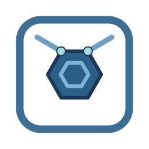

<p align="center">
  
</p>

<h1 align="center">Agent Harness Bootstrap</h1>

<p align="center"><b>Give an AI agent a repo it can actually understand, and a harness it cannot escape.</b></p>

<p align="center">by <a href="https://github.com/nguyenhx2">nguyenhx2</a> · <b>English</b> · <a href="README.ja.md">日本語</a></p>

[](https://github.com/nguyenhx2/agent-harness-bootstrap/actions/workflows/eval.yml) [](LICENSE) [](harness-bootstrap/assets/claude/agents/)
[](eval/guardrail_eval.py) [](https://claude.com/claude-code) [](https://github.com/nguyenhx2/agent-harness-bootstrap/releases/latest)

📊 [Slide presentation](https://nguyenhx2.github.io/agent-harness-bootstrap/presentation/) · 🎥 [Video gallery](https://nguyenhx2.github.io/agent-harness-bootstrap/video/) · 📦 [Latest release](https://github.com/nguyenhx2/agent-harness-bootstrap/releases/latest) · 📚 [Docs map](#-docs-map)

---

## 🎬 What it does

Two skills for **Claude Code**. Before them: you paste a prompt into an AI coding agent, it guesses at
requirements nobody wrote down, edits files with nothing stopping it from committing a secret or
pushing to `main`, and forgets everything the moment its context window fills up. After: it reads a
spec with real acceptance criteria, works inside a generated `.claude/` **harness** (a folder of
agents, rules, and enforcement scripts that shapes what an AI agent may do) that blocks the dangerous
actions before they happen, and leaves a written trail so a fresh session can resume mid-task.

<p align="center">
  <a href="https://nguyenhx2.github.io/agent-harness-bootstrap/video/">
    
  </a>
</p>

<p align="center"><i>The whole product in one clip.</i> <b><a href="https://nguyenhx2.github.io/agent-harness-bootstrap/video/">Watch the full set in the gallery</a></b> - six clips, sound-free captions, no download.</p>

- **[`spec-builder`](spec-builder/)** creates the thing you and the AI both understand - one shared
  voice, built from an idea, a transcript, meeting notes, or a pile of legacy docs, into a 13-section
  contract with stable requirement IDs and acceptance criteria. It never invents a requirement;
  anything unstated becomes a flagged open issue instead of a guess.
- **[`harness-bootstrap`](harness-bootstrap/)** creates the frame that lets AI operate autonomously
  AND safely - the `.claude/` harness it runs inside: scoped agents, path-based rules, blocking
  **hooks** (scripts that intercept a risky action and refuse it), and a task board that survives a
  crash. It reads your code first, so what it generates fits *your* repo instead of a template you
  edit by hand.
- The guardrails are shell scripts and exit codes, not the model's judgment. Swap every agent from
  Opus to Haiku and the safety floor is byte-identical - `python eval/guardrail_eval.py` proves it,
  25/25.

<p align="center">
  
</p>

---

## 🚀 Quickstart

Requires **Python 3**. Install both skills in one line:

```bash
curl -fsSL https://github.com/nguyenhx2/agent-harness-bootstrap/releases/latest/download/agent-harness-bootstrap.zip -o skills.zip \
  && unzip -o skills.zip -d ~/.claude/skills/ \
  && rm skills.zip
```

Then, inside Claude Code:

```text
/spec-builder           # write the specs first, if you're starting from an idea
/harness-bootstrap      # build (or update) the .claude harness for this repo
```

If the repo already has code, run `/harness-bootstrap` on its own - it reads the code first and
pre-fills the intake with what it found. Existing files are **reconciled, not overwritten**: anything
that conflicts is reported and left for you to merge. Nothing is written until you approve the plan.

**One skill at a time, a pinned version, checksums, from source, or running the harness in Cursor and
Codex instead of Claude Code:** see [`docs/tools/`](docs/tools/) -
[Claude Code](docs/tools/claude-code.md) · [Cursor](docs/tools/cursor.md) · [Codex](docs/tools/codex.md).

---

## 📦 What you get

```text
.claude/
  agents/     15 agents, each with an explicit model, effort, tool grant, and turn limit
  rules/      15 rules - 6 always loaded, 9 that load only when you touch a matching file
  commands/   20 slash commands, including the six tuning commands below
  hooks/      9 hooks that block a dangerous action before it happens (one advisory-only, and says why)
  settings.json
docs/
  tasks/      the board: one row per task, a session log the agent writes AS IT WORKS
  context/    code-graph.md - a mermaid module map + fan-in/fan-out, kept honest by a non-blocking
              hook that flags it stale the moment source changes, rebuilt on request via /code-graph
  specs/ requirements/ architecture/ templates/
AGENTS.md + CLAUDE.md
```

| An agent tries to | Result |
|---|---|
| Read `.env`, a private key, `~/.ssh/`, or a path classified Restricted | Blocked |
| Commit straight to `main`, or ship an AI-attribution trailer | Blocked |
| Edit an Accepted ADR, or spawn an off-roster agent | Blocked |

Two defaults worth knowing before you run intake: **TDD + DDD are both on by default** as the dev-seat
methodology (tests-first plus domain-bounded scopes; drop one only if you deliberately want a single
discipline - see [`intake.md`](harness-bootstrap/reference/intake.md)), and **deployment rights
default to human-only** - `deploy` sits in `permissions.deny` until intake's control-level question
(or `/harness-tune` later) explicitly moves it to `ask`. The spawn boundary itself - only a roster
seat may run, and only at its pinned model - is enforced by the `guard-agent-spawn` hook, not by a
rule an agent could drift from.

Full guarantees, the memory model, and the cost breakdown: [`docs/ASSESSMENT.md`](docs/ASSESSMENT.md),
[`docs/CONTEXT-MANAGEMENT.md`](docs/CONTEXT-MANAGEMENT.md),
[`cost-model.md`](harness-bootstrap/reference/cost-model.md).

---

## 🎛️ Post-bootstrap tuning

The harness's starting posture is not permanent. Five commands ship into every bootstrapped repo to
adjust it after the fact - full guidance, worked examples, and the invariants each one enforces live
in [`docs/TUNING.md`](docs/TUNING.md).

| Command | What it does |
|---|---|
| [`/board-audit`](docs/TUNING.md#board-audit) | Read-only sweep for orphaned tasks, unlogged runs, board drift, and a stale code graph |
| [`/harness-tune`](docs/TUNING.md#harness-tune) | Retune control level - deploy rights, destructive-command posture, spawn allowlist, caps, review scope |
| [`/agent-permissions`](docs/TUNING.md#agent-permissions) | Grant or revoke one tool on one roster seat |
| [`/harness-update`](docs/TUNING.md#harness-update) | Re-run the scaffolder to pick up new assets or a changed codebase, conflicts flagged, never clobbered |
| [`/code-graph`](docs/TUNING.md#code-graph) | Rebuild the module knowledge graph (mermaid + JSON) an agent consults before a cross-module change |
| [`/skill-wire`](docs/TUNING.md#skill-wire) | Wire an installed [skills.sh](https://www.skills.sh/) skill to a roster seat - content re-review, scope match, recorded |

Three things none of the six will ever do, no matter what you confirm:
reviewers never gain write access, only the orchestrator spawns, and the code-review gate cannot be
removed - only rescoped.

---

## 🗺️ Docs map

| | |
|---|---|
| [`docs/FLOWS.md`](docs/FLOWS.md) | Seven diagrams: the scaffolder, one feature end to end, context loading |
| [`docs/CONTEXT-MANAGEMENT.md`](docs/CONTEXT-MANAGEMENT.md) | RAM vs. disk, the crash-resume protocol, hard vs. soft controls |
| [`docs/ASSESSMENT.md`](docs/ASSESSMENT.md) | Scorecard, including what this does not do |
| [`docs/TUNING.md`](docs/TUNING.md) | The six post-bootstrap tuning commands, in full |
| [`docs/RELEASING.md`](docs/RELEASING.md) | Semver, artifacts, the release note format |
| [`CONTRIBUTING.md`](CONTRIBUTING.md) | Dev setup, the gates a PR must pass, asset editing rules |
| [Slide presentation](https://nguyenhx2.github.io/agent-harness-bootstrap/presentation/) | EN / VI / JP |
| [Video gallery](https://nguyenhx2.github.io/agent-harness-bootstrap/video/) | Six clips, sound-free captions, no download |
| [`roster.md`](harness-bootstrap/reference/roster.md) | Every agent's model, effort, tools, turn limit, and why |
| [`cost-model.md`](harness-bootstrap/reference/cost-model.md) | How model, effort, tools, and cache stability affect the bill |
| [`task-control.md`](harness-bootstrap/reference/task-control.md) | The orchestration loop, crash recovery, merge discipline |
| [`ba-standards.md`](spec-builder/reference/ba-standards.md) | Which standards the 13 spec sections draw on |
| [`benchmark/RESULTS.md`](benchmark/RESULTS.md) | Benchmark numbers and their caveats |

**Numbers**, measured against the predecessor skill this replaces - reproduce with
`python benchmark/benchmark.py`:

| | Before | After | Δ |
|---|---:|---:|---:|
| Bytes the model must read to bootstrap a repo | 234,196 | 107,311 | **-54%** |
| Bytes the model must write as output | 95,064 | 13,881 | **-85%** |
| Rule content kept out of the default session | - | 51,785 of 77,452 B | **67%** |
| Guardrail eval | - | **25/25** | - |

---

## 👤 Who made this

Built by [**nguyenhx2**](https://github.com/nguyenhx2). Contributions welcome - start with
[`CONTRIBUTING.md`](CONTRIBUTING.md).

## 📄 License

MIT - see [LICENSE](LICENSE).
