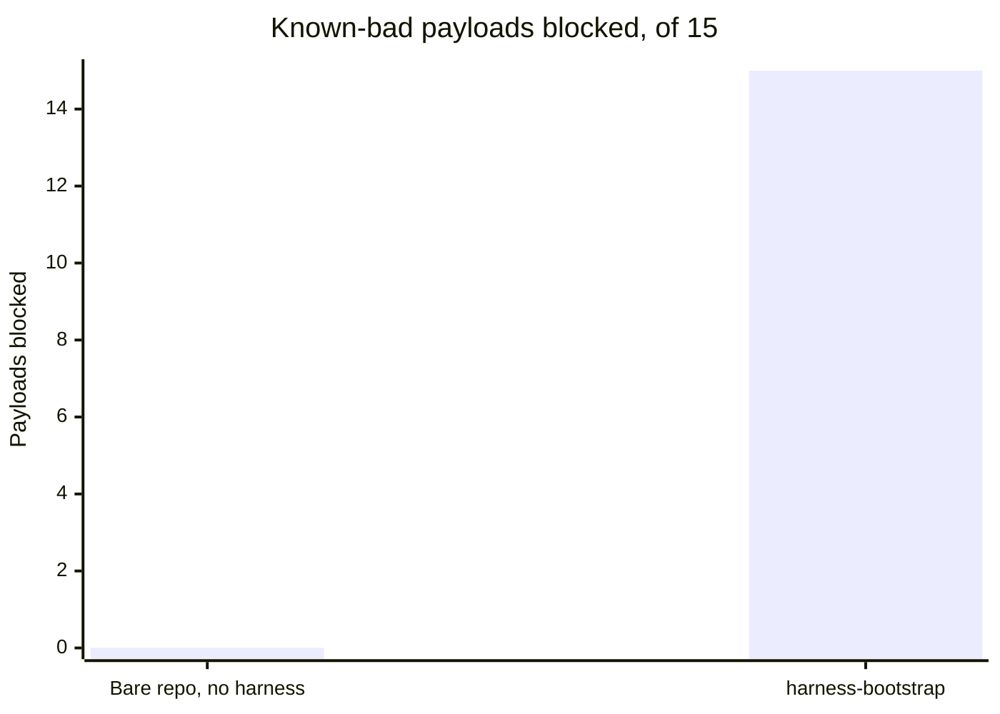
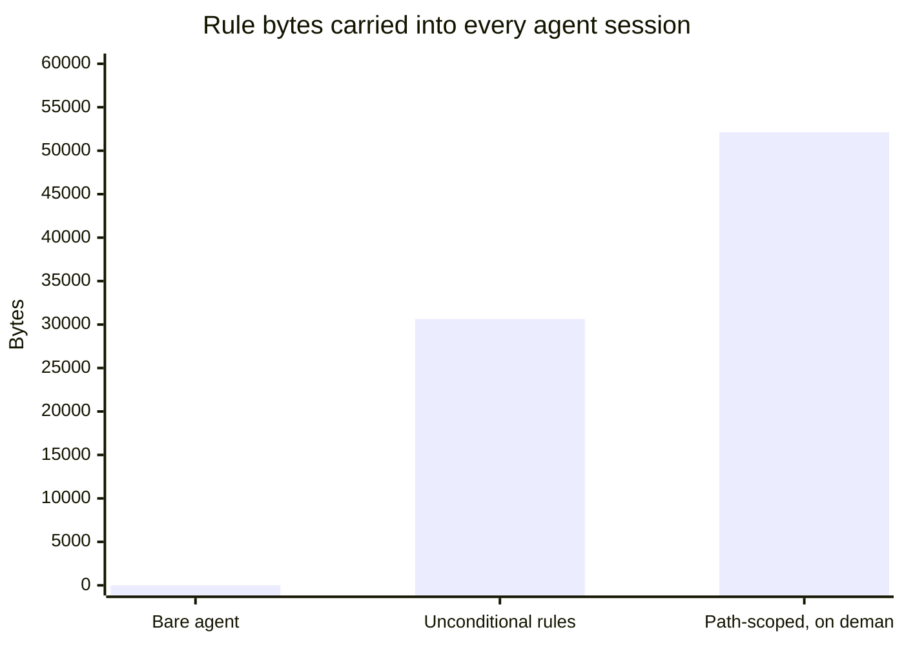

# Benchmark results

What you get for adopting `harness-bootstrap`, measured against the three things you would
otherwise do: nothing, it by hand, or plain prompting with no control layer. Everything below is
counted from files on disk or produced by a real run, and reproduced by one command.

```bash
python benchmark/benchmark.py
```

## At a glance

| | No harness | harness-bootstrap |
|---|---:|---:|
| Known-bad actions blocked (15 hook payloads) | **0** | **15** |
| Bytes of harness you author yourself | **326,087** | **0** |
| Rule bytes loaded into every agent session | **0** | **30,643** |
| Time to stand it up | - | ~0.2s |

The third row is not a typo and it is not in our favour. A bare agent carries no rules because
there are none to enforce. That is the trade this project is making, and a benchmark that hid it
would not be worth reading.

## Baseline A - no harness at all

The same known-bad payloads that `eval/guardrail_eval.py` fires, sent to a generated harness and to
a bare repo. The two repos have identical files and identical git history. The only difference is
the presence of `.claude/`.



| | Blocked | Of cases |
|---|---:|---:|
| Bare repo, no harness | 0 | 15 |
| harness-bootstrap | 15 | 15 |

All 15 payloads had no hook to receive them in the bare repo: it contains 0 hook files and no
`settings.json`. The 15 break down as 6 secret reads, 4 off-roster or escalated agent spawns,
3 commit-message violations, 1 commit straight to the default branch, and 1 edit to an Accepted ADR.

"Nothing stopped it" is demonstrated, not asserted. The script performs the underlying actions in
the bare repo and checks them by effect:

| Action | Result | Evidence |
|---|---|---|
| Read `.env` | COMPLETED | 51 bytes read, including `API_KEY` |
| Commit straight to the default branch | COMPLETED | `HEAD` moved on `main` |
| Commit `stuff` with an AI-attribution trailer | COMPLETED | landed, trailer present |
| Edit an Accepted ADR | COMPLETED | file grew 25 to 53 bytes |

This is the claim the project actually rests on. The guardrails are hooks and deny rules - shell
scripts, exit codes and glob matching - so the result does not move when the model does.

## Baseline B - by hand

What you would author yourself to stand up the same harness. Measured by scaffolding one and
weighing what landed.

| Kind | Files | Bytes |
|---|---:|---:|
| Scripts | 7 | 87,969 |
| Rules | 15 | 78,202 |
| Hooks | 11 | 66,774 |
| Commands | 20 | 36,695 |
| Agents | 10 | 26,053 |
| Docs scaffolding | 10 | 15,415 |
| Root files | 5 | 12,172 |
| `settings.json` | 1 | 2,807 |
| **Total** | **79** | **326,087** |

Around 90,600 estimated tokens if a model authors it instead of you.

Two honest qualifications:

- **This is the part you do not author. It is not the whole job.** On top of it you still write
  `tech-stack.md`, `coding-standards.md`, `git-workflow.md`, the orchestrator's routing table and
  each dev agent's scope. Those three rules ship as no asset at all, deliberately: they are
  decisions about your repo and no template can make them for you.
- **The scripts row is the most arguable line.** Those seven are working tools - the graph scanners,
  the toggle, the env reader, the board checker - not configuration. A team doing this by hand might
  reasonably not build them, in which case the honest figure is 238,118 bytes, not 326,087.

Deliberately not stated in hours. Hours are not measurable from a repository, and any number here
would be a guess wearing a lab coat.

## Baseline C - direct LLM calls, no control layer

The measurable part is context. Every rule without `paths:` frontmatter loads into every session of
every agent, forever. That is rent.



| | Rules | Bytes | Tokens (est.) |
|---|---:|---:|---:|
| Bare agent, no harness | 0 | 0 | 0 |
| Unconditional, always loaded | 7 | 30,643 | ~8,500 |
| Path-scoped, loaded on demand | 9 | 52,113 | ~14,500 |

64% of rule content stays out of the default session. The seven that cannot be scoped are the ones
no glob can match: `00-overview`, `agent-guardrails`, `task-tracking`, `conventional-commits` (it
governs commit *messages*, not files, which is why it is kept under 25 lines on purpose),
`output-style` (it governs how the agent writes, which no path predicts), and the two governance
rules `model-policy` and `ai-governance`, which decide what may be sent where before any file is
touched.

**What is not measurable here, and is not claimed:** whether the code an agent produces is better
with a harness than without. Output quality, task success rate, time to a correct change and review
burden are all real and all absent from this page, because none of them can be counted from a
repository. Baseline A measures enforcement, not judgment.

## Scaffold

A first run takes **~0.2s** (0.18-0.31s across runs), creates 91 paths, and exits 0. A re-run
reports `KEPT` and clobbers nothing. An unresolved `{{VAR}}` makes it exit non-zero rather than ship
a placeholder into a rule.

The comparison is not a fifth of a second against some other number of seconds. It is deterministic
file copying against a model generating ~90,000 output tokens, which takes minutes, costs real
money, and can hallucinate a hook that does not run.

## For the record - against the predecessor skill

This benchmark used to compare `harness-bootstrap` against `project-bootstrap`, the skill it
replaced. That number is kept because it is true, and demoted because it answers "did our rewrite
beat our last attempt", which matters to us and to nobody choosing whether to adopt this.

Read path: 234,196 to 138,187 bytes, about -41%.

That figure moves whenever the skill's reference docs change, and it has moved twice this cycle as
capability landed. A benchmark that only ever improves is a marketing document.

## Methodology

- **Bytes are exact**, counted from files on disk. **Tokens are estimated** at 3.6 chars/token when
  no `ANTHROPIC_API_KEY` is set; with a key the script calls the real `count_tokens` endpoint. The
  source is labelled either way, and a derived number is never printed as a measured one.
- **Baseline A imports the eval's own payload suite** rather than re-declaring it, so the safety
  number cannot drift from the suite it claims to represent. It runs the `.sh` hook flavor and is
  skipped with a message if `bash` is unavailable.
- **Baseline A counts only the 22 must-block payloads** in the eval's hook suite. The eval's full
  107 cases per flavor include must-allow cases and the scaffold, ledger and toggle suites, which
  measure different properties and are not safety wins.
- **The bare repo is built from the same fixtures** as the harnessed one, then has `.claude/`
  removed. If it lacked the `.env` or the ADR, "nothing was blocked" would be trivially true.
- **Not measured here:** cost across model tiers (`benchmark/model_cost.py` models that separately)
  and per-dispatch tool-schema cost, which needs runtime instrumentation this script does not have.

Hardware: Windows 11, Python 3.13. Scaffold timings are wall-clock, single run.
Run `python benchmark/benchmark.py --skip-guardrails` to skip Baseline A, the only slow part.
