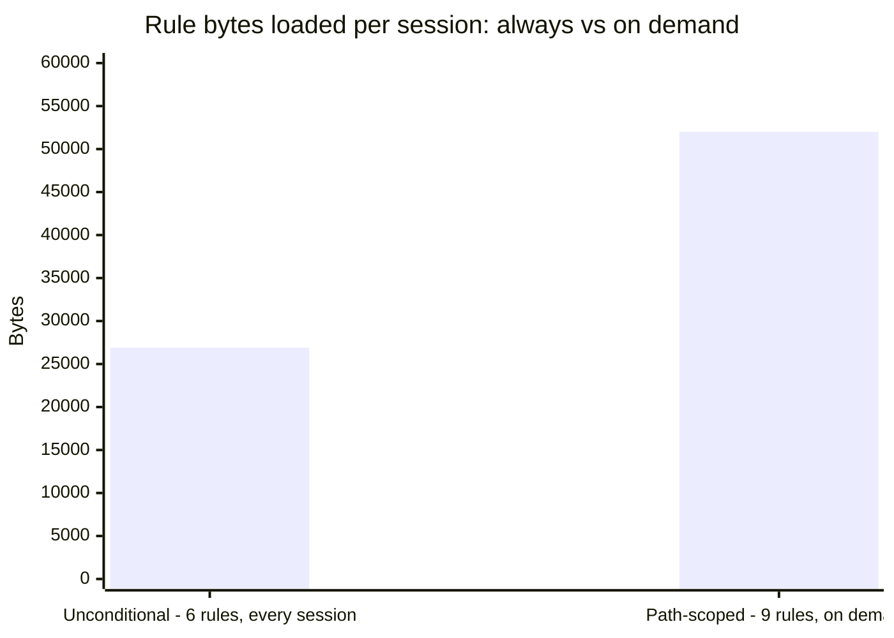
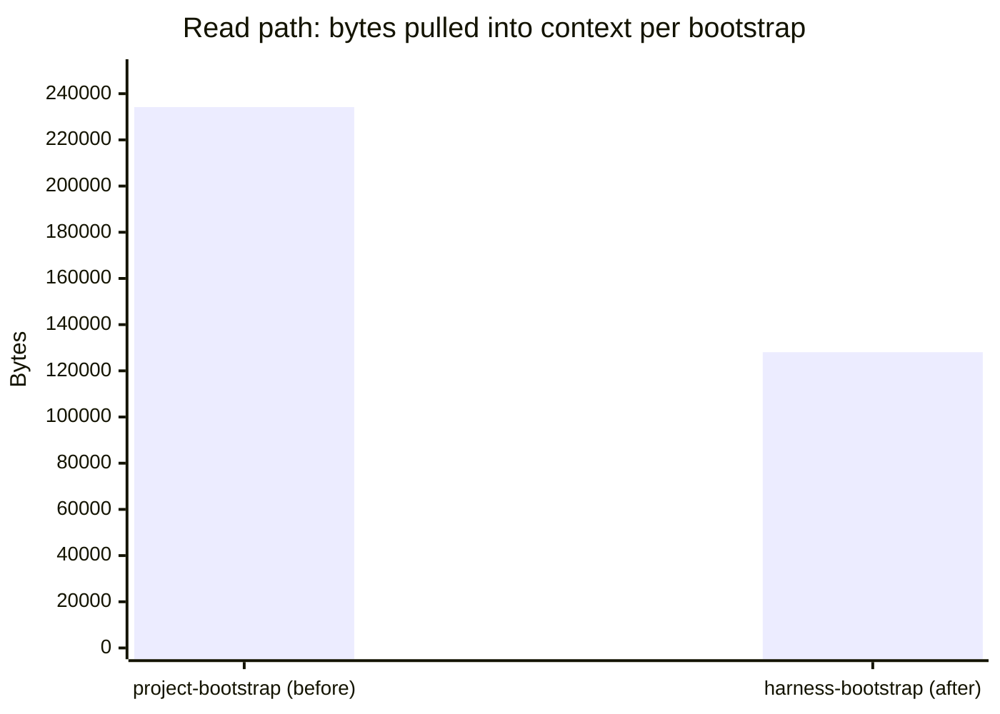
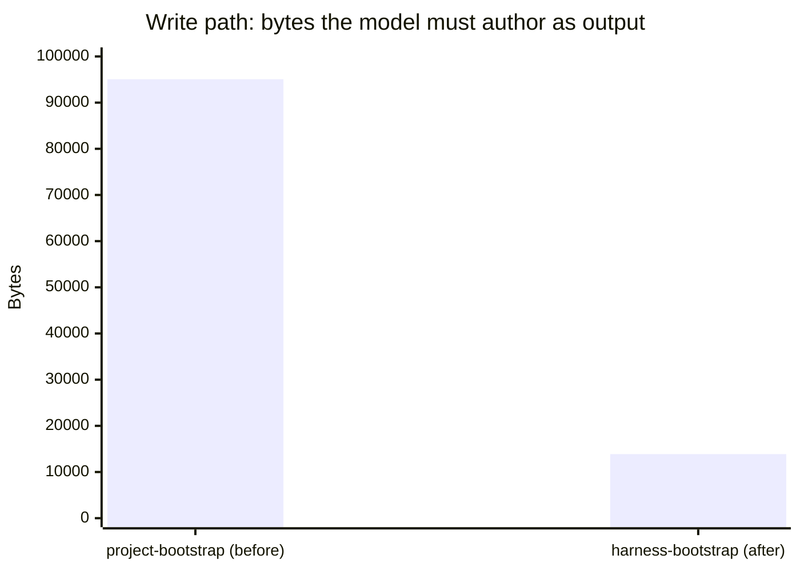

# Benchmark results

`harness-bootstrap` against `project-bootstrap`, the predecessor skill it replaces. Everything below
is counted from the files on disk (see [Methodology](#methodology)) and reproduced by one command.

## The three goals this benchmark proves

1. **Cheap sessions** - the context tax an agent pays on every turn. A rule with no `paths:`
   frontmatter loads into every session of every agent, forever. That is rent, not a one-time cost.
2. **Fast onboarding** - what a fresh model must read before it can act. The old skill's hooks,
   commands, rules and templates were fenced code blocks inside markdown; to use them, the model had
   to read all of them.
3. **Safe writes** - what the scaffolder writes byte-for-byte vs what a model would have to
   hand-type. A byte a model hand-types is a byte it can drop, garble, or invent. A byte the
   scaffolder copies cannot.

## At a glance

| | project-bootstrap | harness-bootstrap | Change |
|---|---:|---:|---:|
| Read path (bytes the model must pull into context) | 234,196 | 128,072 | -45% |
| Read path (files read) | 24 | 10 | -58% |
| Write path (bytes the model must author) | 95,064 | 13,881 | -85% |
| Session tax kept out of every launch | - | 66% | - |
| Scaffold time | - | ~0.2s | - |

## Goal 1 - Cheap sessions

66% of rule content stays out of the default session: 6 unconditional rules load every time; 9
path-scoped rules load only when Claude actually touches a matching file. The database agent no
longer carries the frontend rules; the UI agent no longer carries the migration-safety rules.



| | Rules | Bytes | Tokens (est.) |
|---|---:|---:|---:|
| Unconditional (always loaded) | 6 | 26,902 | ~7,500 |
| Path-scoped (loaded on demand) | 9 | 52,011 | ~14,400 |

The six that stay unconditional are the ones no glob can scope: `00-overview`, `agent-guardrails`,
`task-tracking`, `conventional-commits` (governs commit *messages*, not files, so no `paths:` pattern
can ever match it - which is why it is kept under 25 lines on purpose), and the two governance rules
`model-policy` and `ai-governance`, which decide what may be sent where before any file is touched.

## Goal 2 - Fast onboarding

The new skill reads `SKILL.md` plus nine reference docs - 10 files. It never reads `assets/`: the
scaffolder copies those files directly, so they never enter the context window at all.

This is where the honest trade lives. The read-path reduction was 54% last release; it is 45% now.
It dropped because the skill does more, not because it got sloppier: a tech-presets catalogue, four
skill-discovery sources instead of one (skills.sh, GitHub, Anthropic's own repos, plugin
marketplaces), three more intake questions (internationalization, authorization, operations
posture), and a set of superpowers-derived disciplines (a typed-confirmation word for irreversible
actions, third-attempt escalation, a ban on placeholder acceptance criteria) all landed this cycle.
Two of the files that grew were then compressed hard to claw part of it back -
`reference/tech-presets.md` 24.6KB -> 9.8KB, `reference/intake.md` 23.1KB -> 19.9KB - which is why
the number moved from 54% to 45% and not further. A benchmark that only ever improves is a marketing
doc; this cycle the skill bought capability with read-path budget, and only partly bought it back.



| | Files read | Bytes | Tokens (est.) |
|---|---:|---:|---:|
| project-bootstrap | 24 | 234,196 | ~65,000 |
| harness-bootstrap | 10 | 128,072 | ~35,600 |
| **Reduction** | **-58%** | **-45%** | **-45%** |

## Goal 3 - Safe writes

Output tokens cost 5x input across every current model, and the old skill's core loop was *read
1,350 lines of assets, then retype them*. What the new skill still authors by hand is what cannot be
templated - `tech-stack.md`, `coding-standards.md`, `git-workflow.md`, the orchestrator's routing
table, and each dev agent's scope. Those are decisions about a specific repo; everything else is a
file copy.



| | Files authored | Bytes | Tokens (est.) |
|---|---:|---:|---:|
| project-bootstrap | 11 packs -> ~60 files | 95,064 | ~26,400 |
| harness-bootstrap | 3 + `vars.json` | 13,881 | ~3,900 |
| **Reduction** | | **-85%** | **-85%** |

The scaffolder is the other half of "safe": a first run takes **~0.2s** (varies 0.15-0.30s across
runs) and creates 91 paths. On this run it exits 1, not 0: this benchmark's vars payload does not
supply `GLOSSARY_SEED`, a var `docs/context/glossary.md` picked up when the living-glossary work
landed, so the scaffolder fails closed on the unresolved placeholder instead of shipping it into a
doc - the exact behavior the next sentence describes, caught live rather than asserted. A re-run
reports `KEPT` with 0 conflicts on everything it did write - nothing clobbered. An unresolved
`{{VAR}}` makes the scaffolder exit non-zero rather than ship a placeholder into a rule. That
comparison is not a fifth of a second against some other number of seconds; it is deterministic file
copying against a model generating ~26,000 output tokens, which takes minutes, costs real money, and
can hallucinate a hook that does not run.

## Methodology

- **Bytes are exact**, counted from the files on disk. **Tokens are estimated** at 3.6 chars/token
  when no `ANTHROPIC_API_KEY` is set (this run); the script uses the real `count_tokens` endpoint and
  labels the source either way when a key is present.
- **The write-path baseline is a proxy.** The old skill's output was not deterministic. It is sized
  here by the bytes of the template packs it had to reproduce - the closest countable stand-in, and
  conservative: the old skill also authored the rules, agents, `CLAUDE.md` and docs tree from prose
  briefs, none of which is counted here.
- **This measures the harness, not the outcome.** A cheaper bootstrap that produced a worse harness
  would be a bad trade. Correctness claims - hooks that actually block, rules that actually load - are
  covered by `eval/guardrail_eval.py`, not by this benchmark.
- **Not measured here:** cost across model tiers (`benchmark/model_cost.py` models that separately)
  and the per-dispatch cost of tool schemas (needs runtime instrumentation this script does not have).

## Reproducing

```bash
python benchmark/benchmark.py
```

Set `ANTHROPIC_API_KEY` to replace the estimated token columns with measured ones from the
`count_tokens` endpoint.

Baseline: `project-bootstrap`, the predecessor skill, at the commit it was replaced.
Hardware: Windows 11, Python 3.13. Scaffold timings are wall-clock, single run.
