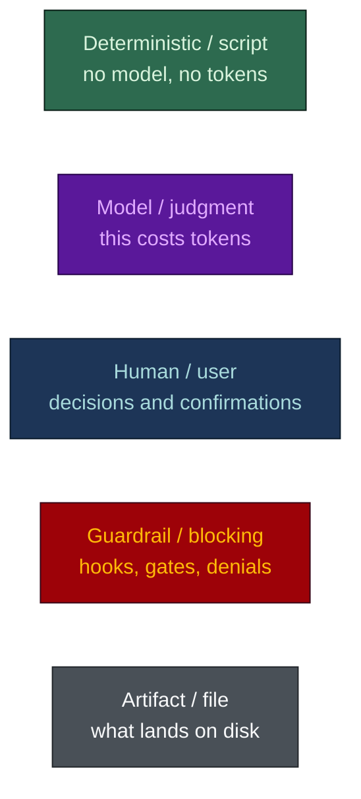
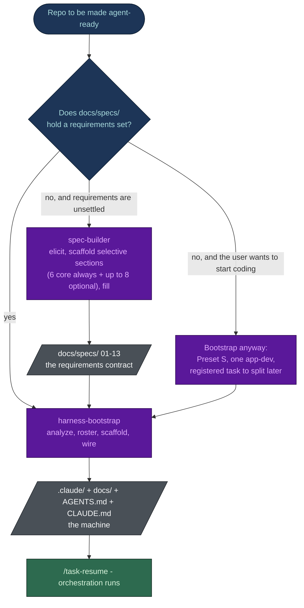
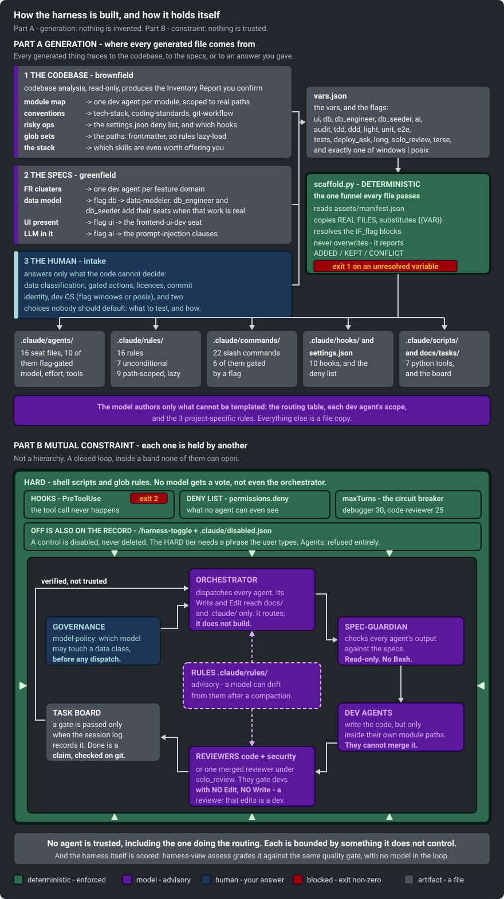
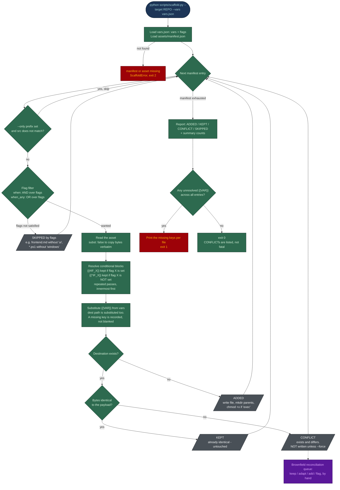
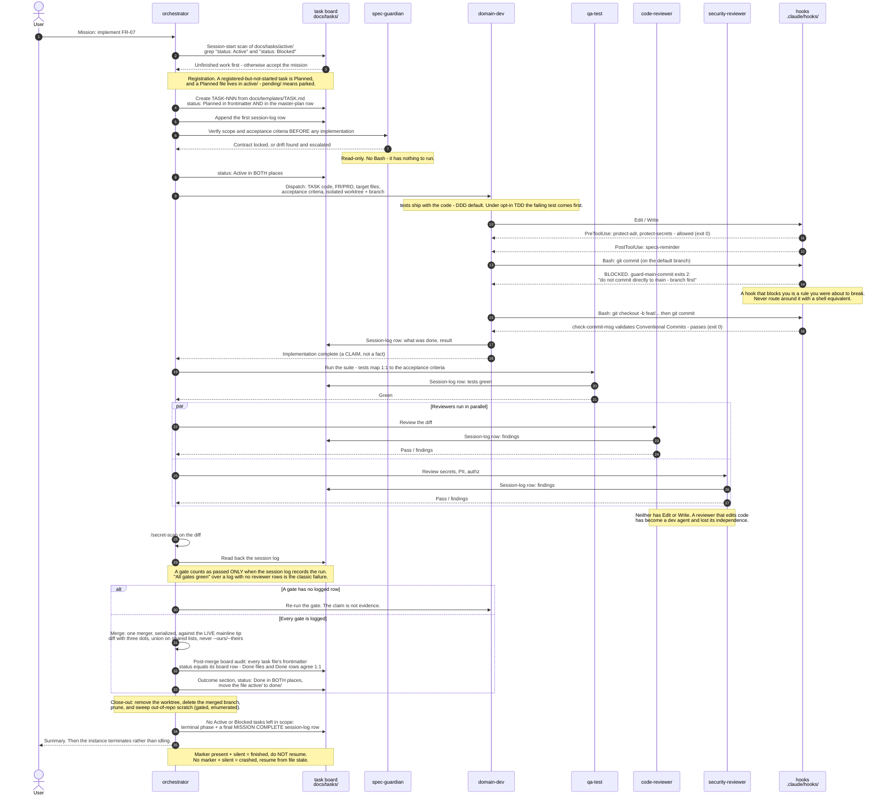
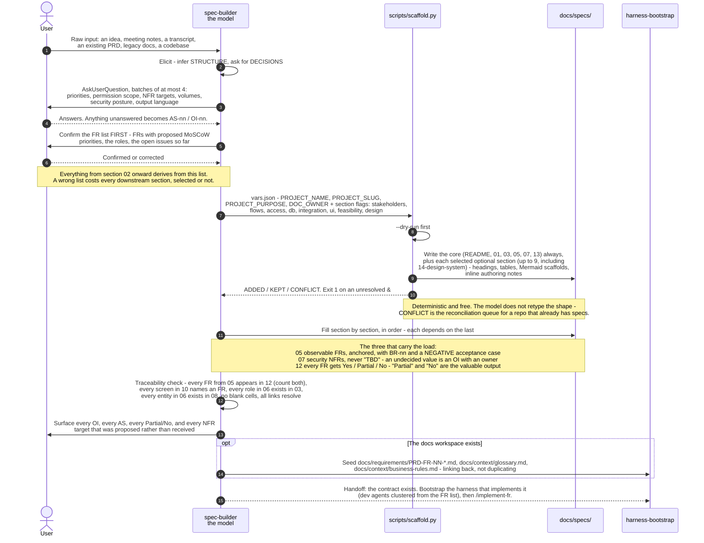
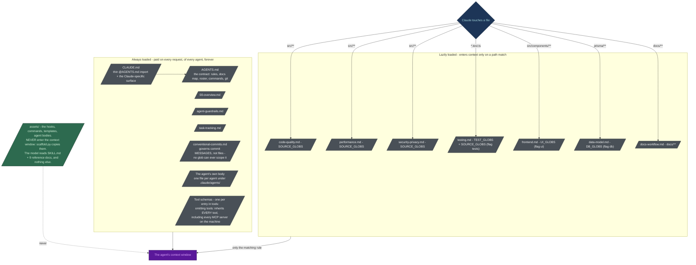

# Flows

Visual reference for the two skills in this repo: `spec-builder`, which produces the requirements
contract, and `harness-bootstrap`, which builds the machine that implements it.

Every diagram below is Mermaid and renders natively on GitHub. The claims in them are taken from the
source: `harness-bootstrap/SKILL.md`, its `reference/` docs, `scripts/scaffold.py`,
`assets/manifest.json`, `assets/claude/settings.json`, `spec-builder/SKILL.md`, and
`benchmark/RESULTS.md`. Section 7 is the exception - a written command reference rather than a
diagram, placed here because it documents the commands diagram 4's sequence actually calls.

## Legend

The colours carry meaning: **green is free, purple is billed**. A step is green when a script does it
deterministically for zero tokens, and purple when a model has to think about it. `harness-bootstrap`
moves as much of the work as possible from purple to green: the assets are real files copied by
`scaffold.py`, not 1,300 lines of prose for a model to retype.

Mermaid applies `classDef` to flowcharts only, not to sequence diagrams. The two sequence diagrams
below therefore carry the same semantics in their prose and notes rather than in fills.

## 1. Overall system flow - how the two skills relate

`spec-builder` writes the contract; `harness-bootstrap` builds the machine that implements it. They
are separate skills because they answer different questions: *what must be true* versus *who builds
it, under what guardrails, at what cost*. The decision point is whether `docs/specs/` already holds a
requirements set. If it does, go straight to `harness-bootstrap`. If it does not, either run
`spec-builder` first, or bootstrap with a single `app-dev` and register a task to split it once
modules emerge. `harness-bootstrap` does not require specs to exist; it fields a smaller roster when
they do not.

The dependency runs one way. `spec-builder` writes into a docs tree that `harness-bootstrap` creates,
so on a repo with no docs tree at all, `harness-bootstrap` runs first and `spec-builder` fills the
`docs/specs/` folder it made. Once section 03 (glossary) and section 05 (functional requirements) are
filled, `spec-builder` also seeds `docs/requirements/PRD-FR-NN-*.md`, `docs/context/glossary.md`, and
`docs/context/business-rules.md` - seeding, not duplicating: the spec section remains the source of
truth and the context files link back to it.

## 2. harness-bootstrap, end to end

Read it as three bands: a **purple** analysis and decision phase where a model is required, a
**green** scaffolding step where a script does the bulk copying for free, and a second **purple**
phase for the things no template can know - the routing table, each dev agent's scope, the real deny
commands. The `CONFLICT` branch out of the scaffolder is not an error path: it is the brownfield
reconciliation queue, and it is why the scaffolder never overwrites a file the user wrote.

```mermaid
flowchart TD
    START(["User invokes /harness-bootstrap"])
    MODE{"Mode"}

    GF["Greenfield<br/>empty or near-empty repo"]
    BF["Brownfield<br/>source exists, agents will modify it"]
    AU["Audit<br/>agents analyze, a human applies fixes"]

    ANALYZE["Codebase analysis - MANDATORY<br/>stack, modules, data layer, integrations,<br/>conventions, risky ops, existing .claude/, git reality"]
    INV[/"Inventory Report<br/>mapping tables: modules to dev agents,<br/>conventions to rules, risky ops to deny and hooks"/]
    CONFIRM{"User confirms<br/>or corrects the report"}

    INTAKE["Intake questionnaire<br/>AskUserQuestion, max 4 per call.<br/>Brownfield: pre-fill from evidence, ask only<br/>what code cannot decide"]
    TOOLS["Detect + confirm target tools<br/>ranked evidence: only settings.json hooks, .cursor/<br/>and .codex/ own formats are Strong - CLAUDE.md and<br/>.claude/agents are Weak, AGENTS.md alone asks.<br/>Answer persists as target_cursor / target_codex"]
    PLAN{"One-screen setup plan:<br/>created / kept / modified,<br/>roster with model + effort.<br/>User confirms"}

    ROSTER["Pick the roster<br/>Tier 0 unconditional, preset S/M/L,<br/>explicit model: AND effort: on every agent"]
    SKILLS["Skill discovery and install<br/>search skills.sh per seat, trust rubric +<br/>mandatory content read, yes per skill"]
    OS["Detect the dev OS<br/>Windows to .ps1, macOS or Linux to .sh<br/>sets the windows / posix flag"]
    VARS[/"vars.json<br/>vars + 21 flags: ui, db, db_engineer, db_seeder, ai,<br/>audit, tdd, ddd, light, unit, e2e, tests, deploy_ask,<br/>long, solo_review, terse, rtk, pr_cli,<br/>target_cursor, target_codex,<br/>exactly one of windows / posix"/]

    DRY["scaffold.py --dry-run"]
    SCAFFOLD["scaffold.py<br/>deterministic copy of assets/"]

    ADDED[/"ADDED<br/>file did not exist"/]
    KEPT[/"KEPT<br/>exists and is byte-identical"/]
    CONFLICT[/"CONFLICT<br/>exists and differs - not written"/]
    MISSINGVAR["Unresolved {{VAR}}<br/>exit 1 - fails loudly"]

    RECONCILE["Reconcile by hand:<br/>keep / adapt / add / flag.<br/>Never clobber what the user wrote"]

    GAPFILL["Model-authored gap-fill<br/>orchestrator routing table, dev-agent scopes,<br/>tech-stack.md, coding-standards.md, git-workflow.md,<br/>settings.json allow/deny for the real stack, .env.example"]
    WIRE["Orchestration wiring<br/>master-plan index table, Phase 1 seeded from the<br/>analysis gap list, AGENTS.md entry point,<br/>CLAUDE.md as a thin @AGENTS.md import"]

    GATE{"Quality gate<br/>structure / cost and context / safety /<br/>grounding / handoff"}
    SMOKE["Smoke-test the loop:<br/>real task file, master-plan row,<br/>session-log row, /task-resume"]
    PORT["Port to the RECORDED targets<br/>port.py --tool cursor / codex / all:<br/>.cursor/rules + adapter, .codex/hooks.json.<br/>/harness-update re-reads them, never re-asks"]
    DONE(["Harness runs under orchestration"])

    START --> MODE
    MODE -->|"no source"| GF
    MODE -->|"source, agents may write"| BF
    MODE -->|"source, agents never write"| AU

    GF --> INTAKE
    BF --> ANALYZE
    AU --> ANALYZE
    ANALYZE --> INV --> CONFIRM
    CONFIRM -->|"corrections override findings"| ANALYZE
    CONFIRM -->|"confirmed"| INTAKE

    INTAKE --> TOOLS --> PLAN
    PLAN -->|"changes requested"| INTAKE
    PLAN -->|"confirmed"| ROSTER
    ROSTER --> SKILLS --> OS --> VARS
    VARS --> DRY --> SCAFFOLD

    SCAFFOLD --> ADDED
    SCAFFOLD --> KEPT
    SCAFFOLD --> CONFLICT
    SCAFFOLD --> MISSINGVAR
    MISSINGVAR -->|"add the var, re-run"| VARS

    CONFLICT --> RECONCILE
    ADDED --> GAPFILL
    KEPT --> GAPFILL
    RECONCILE --> GAPFILL

    GAPFILL --> WIRE --> GATE
    GATE -->|"a check fails"| GAPFILL
    GATE -->|"all green"| SMOKE --> PORT --> DONE

    classDef det fill:#2D6A4F,stroke:#081C15,stroke-width:1px,color:#D8F3DC
    classDef mod fill:#5A189A,stroke:#240046,stroke-width:1px,color:#E0AAFF
    classDef hum fill:#1D3557,stroke:#0B1B2B,stroke-width:1px,color:#A8DADC
    classDef gate fill:#9D0208,stroke:#370617,stroke-width:1px,color:#FFBA08
    classDef art fill:#495057,stroke:#212529,stroke-width:1px,color:#F8F9FA

    class ANALYZE,INTAKE,TOOLS,ROSTER,OS,GAPFILL,WIRE,RECONCILE mod
    class DRY,SCAFFOLD,SMOKE,PORT det
    class START,MODE,CONFIRM,PLAN,GF,BF,AU,DONE hum
    class GATE,MISSINGVAR gate
    class INV,VARS,ADDED,KEPT,CONFLICT art
```

Three points from the diagram:

- **Mode is chosen first, and it is not about size.** If agents will never modify the source and a
  human applies every fix, the mode is audit however much code exists; otherwise any source code at
  all means brownfield.
- **The Inventory Report gates everything.** In brownfield and audit it is mandatory, it must be
  shown to the user, and its mapping tables are what turn a generic template into a description of
  this specific codebase. No file is generated before it is confirmed.
- **CONFLICT is a queue, not a failure.** The scaffolder skips those files, prints them, and exits 0.
  Only an unresolved `{{VAR}}` makes it exit non-zero, because a placeholder shipped into a live rule
  file matches nothing and fails silently.

### 2a. Where each artifact comes from, and how the artifacts hold each other

The flowchart above is the procedure. The picture below is the *derivation*: which source each
generated file traces back to - the codebase, the specs, or an intake answer - and, once generated,
how the pieces rein each other in. Read the top panel left to right, and the bottom panel as a ring.

  

Two claims it makes that the flowchart above does not. First, the model authors only what cannot be
templated: the routing table, each dev agent's scope, and the three project-specific rules
(`tech-stack`, `coding-standards`, `git-workflow`). Everything else is a file copy. Second, no seat is
trusted - the orchestrator routes but has no Write outside `docs/` and `.claude/`, the reviewers gate
but hold no `Edit` or `Write`, the board records what the session log can prove, and the hooks bind
every agent including the one dispatching them.

## 3. The scaffolder in detail

`scripts/scaffold.py` is stdlib-only, has no dependencies, and is what makes the skill cheap: it
copies real asset files instead of asking a model to regenerate them. It walks `assets/manifest.json`
once, entry by entry. Everything it does is mechanical, which is why the diagram is green apart from
the two places where it refuses to guess.

The scaffolder refuses two decisions on purpose:

- It **never overwrites.** An existing file that differs is reported and left alone, because on a
  brownfield repo the differing file is usually something a human wrote. Use `--force` for files you
  have explicitly decided to replace.
- It **fails on an unresolved variable** rather than writing a literal `{{DB_RESET_CMD}}` into a deny
  rule that would then never match anything.

Re-running on an unchanged repo is idempotent: everything comes back `KEPT`, nothing is clobbered.

## 4. One feature, end to end through the generated harness

This is the **Guarded** flow - what the generated `.claude/` folder runs when a change spans two or
more domains, or touches schema, auth, money, a public contract, a migration, a deploy, or personal
data. It is not what every change runs. A one-module, reversible change is **Direct**: it goes
straight to the agent that owns that module, with no orchestrator, no task file and no review pass,
because a planning pass costs more than the change. The tier table in the generated `AGENTS.md`
decides which of the two a request is, before anything is dispatched.

Note where the gate sits below: **once, on the branch, at the pull-request boundary** - not after
each agent. A reviewer dispatched per agent re-reads the same files once per agent and reports the
same findings each time. In cost terms: the
orchestrator, the reviewers, and the debugger are Opus seats; the dev agents, `qa-test`, and
`spec-guardian` are Sonnet; the mechanical seats (`history-tracker`, `db-seeder`) are Haiku at `low`
effort. The hooks cost nothing, being shell scripts rather than a model, and they are the only
participant here that can say no.

The sequence below shows the default roster (`tests` chosen, split reviewers). Two flags reshape it:
without `tests`, `qa-test` and its gate do not exist and the diagram's "Run the suite" step is
skipped; with `solo_review` set, `code-reviewer` and `security-reviewer` collapse into one merged
`reviewer` seat and the parallel `par` block below becomes a single pass instead of two.

The files are the truth and an agent's report is a claim. A gate is passed when the task file's
session log holds a row for it, not when an agent says "reviewed". Status lives in two places, the
task file's frontmatter and the master-plan row, and every status change writes both in the same
step, because a merge that resolves a board collision by taking one side reverts a status flip with
no error at all. The hooks are the hard edge: `PreToolUse` fires before the tool runs, exit 2 blocks
it, and the message on stderr goes back to the model. The `MISSION COMPLETE` marker makes "finished"
distinguishable from "crashed" by a file check instead of a guess.

## 5. spec-builder

Same shape, different contract: elicit what only a human knows, let the script lay down the selected
sections - a 6-file core always, plus up to 8 optional sections chosen from what the input material
actually contains - then spend model tokens on the content rather than on the headings. The governing
rule is
that **nothing is invented**. An unstated requirement becomes an assumption (AS-nn) or an open issue
(OI-nn) with a named owner, because a plausible invented requirement gets estimated, built, and
discovered in UAT.

The ordering is a discipline: the FR list is confirmed *before* anything else is written, and the
sections are filled in order because each depends on the last. The traceability check at the end is
mechanical - count the FRs in 05, count the rows in 12, they match - which is the kind of check a
model will skip unless it is written down as a gate.

## 6. Context loading - why the harness is cheap

This is the mechanic behind the numbers in `benchmark/RESULTS.md`. A file in `.claude/rules/` with
**no `paths:` frontmatter** loads at launch, into every session of every agent, at the same priority
as `CLAUDE.md`. It is not a one-time cost, it is rent. Add `paths:` and the rule only enters context
when Claude actually touches a matching file.

7 unconditional rules, nine path-scoped ones (the seventh, `output-style.md`, only with the `terse` flag). On the shipped asset set that is 30,643 bytes always
loaded against 55,062 bytes loaded on demand: **62% of the rule content is kept out of the default
session**, so the database agent no longer carries the frontend rules and the UI agent no longer
carries the migration-safety rules.

Two other levers sit in the same diagram:

- Every tool in an agent's `tools:` list ships its JSON schema on *every* request. Omitting `tools:`,
  and thereby inheriting every MCP server on the machine, is treated as a bug in the quality gate.
- Every file in the always-loaded band is prompt-cache prefix content, so a single `Generated: <date>`
  line in an agent body cold-misses that agent's cache on every future run. No generated file carries
  a timestamp.

## 7. Delivery commands, command by command

Diagram 4 is the procedure; this section is the per-command reference for everything it invokes,
plus the handful of planning and maintenance commands that don't fit a single sequence step.
`docs/TUNING.md` documents the eight commands that adjust the *harness's own posture* (plus the two
`spec-builder` commands that ripple a source into or out of `docs/specs/`). This section documents
the commands used during normal *feature delivery* - the ones a dev agent or the orchestrator runs
while building the product itself. Same shape as `TUNING.md`, terser, since these run far more often:
invocation, what it's for, what it does, what it writes, what it refuses, and when it ships.

### Registering and planning work

#### `/new-task <short-title>`

Creates a task file from the template and registers it on the master plan - the entry point for any
unit of work. Allocates the next `TASK-NNN` sequentially across `active/`, `pending/`, and `done/`,
copies `docs/templates/TASK.md`, fills title/goal/owner/dependencies/priority/phase/acceptance
criteria, sets `status: Planned`, adds the row to `docs/tasks/master-plan.md` and reads it back to
confirm the write landed, then appends the first session-log row. If `.claude/state/code-graph.json`
exists it also seeds a "Relevant modules" line (the owner's module plus everything with a direct
dependency edge into it) so the dispatch brief carries a blast-radius hint before any code is
touched.

**Writes:** a new `docs/tasks/active/TASK-NNN-<slug>.md`, a new row in `master-plan.md`, the first
session-log row. **Refuses:** reusing a task number or overwriting an existing task file on a
collision; proceeding with no title (asks, then stops). **Ships:** unconditional.

#### `/new-adr <decision-title>`

Creates an Architecture Decision Record from the template. Determines the next `ADR-NNN`, copies
`docs/templates/ADR.md`, and fills context, decision, options considered, and consequences -
including the negative ones, since "an ADR with no downside recorded is an advertisement, not a
decision record." Leaves `status: Proposed`; only the user flips it to `Accepted`.

**Writes:** a new `docs/architecture/decisions/ADR-NNN-<slug>.md`, a new row in that folder's
`README.md` index. **Refuses:** writing in anything but English, even on a non-English-docs project -
ADRs stay portable; editing an Accepted ADR at all, which is hook-enforced (`protect-adr`) rather
than a convention - a change of mind is a *new* ADR that supersedes the old one, and every other edit
must land before the accept flip, because the hook reads the on-disk status at flip time and blocks
everything after it. **Ships:** unconditional.

#### `/new-spec-section <section-number-or-name>`

Scaffolds a specification section following the project's standard BA structure. With no argument it
lists which standard sections `docs/specs/` is missing and asks. Dispatches `ba-analyst`, deriving
content from PRDs, the codebase, and the user's answers, and cross-links every FR to an ID,
acceptance criteria, and the use case it serves.

**Writes:** the new/filled `docs/specs/` section, a row in `docs/specs/13-revision-history.md`.
**Refuses:** inventing a requirement - an unanswered question becomes a recorded open question,
never a plausible guess, because "a fabricated requirement is worse than a missing one, because it
looks settled"; inventing a parallel numbering scheme instead of following the existing one.
**Ships:** unconditional (it ships with `harness-bootstrap`, even though it dispatches the
`ba-analyst` agent in the spec-builder style).

#### `/scaffold-feature <feature-slug>`

Creates the skeleton of a feature module: entry point, library module, UI component, failing test -
structure only, no behavior. Follows the layout in `.claude/rules/coding-standards.md`: the entry
point (route handler, controller, or command) does input validation and delegation only, the library
module holds the business logic and is testable without the transport layer, the UI component is
built from existing design-system primitives rather than new one-off styles, and a failing unit test
names the acceptance criterion it will eventually prove.

**Writes:** the new skeleton files; a routing-table row if the feature's domain has no owner yet.
**Refuses:** filling in the business logic - "leave the logic unimplemented rather than filling it
with a plausible guess"; proceeding with no feature slug (asks, then stops). **Ships:** unconditional.

### Implementing

#### `/implement-fr <FR-id>`

Plans and implements a functional requirement end-to-end against its acceptance criteria - the
command diagram 4's sequence actually traces. With no argument it lists FRs that have no task yet and
asks, rather than guessing which one to build. Reads the FR in
`docs/specs/05-functional-requirements.md` (and the matching PRD, if one exists), dispatches
`spec-guardian` to lock scope and acceptance criteria *before* any code is written - an FR with no
observable acceptance criteria stops here and escalates rather than proceeding - registers the work
via `/new-task`, flips it to `Active`, and assigns the specialist per the routing table. Implementation
follows whichever methodology the project chose at intake: test-first under TDD, tests shipped in the
same change under DDD/default, or a session-log note of how each criterion was verified by hand on a
project with no automated suite. Then runs `/test` (if the project has one) followed by
`/review-changes`.

**Writes:** task session-log rows, and the code itself via the dispatched dev agent (plus a glossary
entry for any new domain term, under DDD). **Refuses:** deploying - that is always a separate,
explicit `/deploy`; skipping the review gate, even under Lightweight methodology, which drops
ceremony but not the gate. **Ships:** unconditional.

#### `/db-migration <migration-name>`

Generates a database migration from schema changes, following the ERD and the data dictionary. Diffs
the schema against the data model in `docs/specs/` (updating the ERD and data dictionary in the same
PR/MR if the design is new), generates the migration with the project's migration tool against the
**local development database only**, and reviews the generated SQL before applying it.

**Writes:** the migration file, ERD/data-dictionary updates when the design changed, the seed script
(updated in the same PR/MR so it still matches the schema), a `docs/context/tool-changelog.md` entry.
**Refuses:** running a migration, reset, or schema push against a shared, staging, or production
database under any circumstance - the command file is explicit that this is a gated action and *not*
gated by this command, i.e. out of scope entirely rather than merely restricted; applying generated
SQL automatically when it contains a `DROP` of a populated column/table, a `NOT NULL` added without a
default, a destructive type change, or any other data-loss statement - it escalates to the user
instead, because "generated does not mean safe." **Ships:** only when the `db` flag is set.

#### `/seed-db`

Seeds the local or development database with deterministic synthetic data per the ERD, by dispatching
`db-seeder` under the `db-seed` skill. Checks the connection target first, uses fixed seed values so
two runs produce the same rows, upserts rather than blind-inserts so re-running never duplicates
rows, and verifies row counts per table afterward.

**Writes:** rows in the local/development database (no doc files - the report is the row-count
summary). **Refuses:** running against anything but a local or development database - it refuses
outright if the connection target points at shared, staging, or production; using real customer
records or a production dump, even as a one-off. **Ships:** only when both `db` and `db_seeder` are
set.

### Quality gates

#### `/test`

Runs lint plus the unit and end-to-end suites, and reports each failure with its owning agent. Every
external provider must be mocked - a test that makes a real network call is reported as a failure
even when it passes, because a green result from a live call is not a repeatable one. Reports the
coverage figure against the project's target and whether it regressed against the default branch,
and maps each failure to the agent that owns the code (per the routing table) and the acceptance
criterion it breaks.

**Writes:** a session-log row on the task file recording the run (pass/fail, coverage). **Refuses:**
editing a test to make it pass - a failing test is either a real defect or a wrong expectation, and
deciding which is the point. **Ships:** only when the `tests` flag is set (frameworks vary: unit
only, e2e only, or both, per the testing choice at intake).

#### `/review-changes`

Runs code review and security review on the current diff before opening a PR/MR - no arguments.
Diffs with three dots against the default branch on an existing branch (two dots on a stale branch
reports the branch's own missing commits as false deletions), runs `/secret-scan` first (any real
secret is a blocker), then dispatches the review agents: the merged `reviewer` doing one pass under
`solo_review`, or `code-reviewer` plus `security-reviewer` separately on the default split roster.
Either way, `spec-guardian` verifies the linked FR's and task's acceptance criteria are met, lint and
tests are confirmed locally, and the CI pipeline must be green in a *terminal* state - pending never
counts. Findings are aggregated by severity: blocker, should-fix, suggestion.

**Writes:** a session-log row recording the review and its findings - "a gate counts as passed only
when the log records the run." **Refuses:** merging or deploying - "reviewing is not approving."
**Ships:** unconditional; its shape (merged vs. split reviewers) follows the `solo_review` flag.

#### `/secret-scan`

Scans the current diff (`git diff` plus staged) for secrets and sensitive data before a commit or
PR/MR - no arguments. Looks for credential patterns (`sk-`, `AKIA`, `AIza`, `ghp_`, `glpat-`, `xox`,
JWT-shaped strings, private-key headers, hardcoded `password=`/`api_key=`/`secret=`/`token=`),
forbidden files (`.env*` other than `.env.example`, `*.pem`/`*.key`/`*.jks`/`*.p12`/`*.tfvars`,
service-account JSON), real-looking personal or customer data in fixtures and seeds, and secrets
hiding in CI config, container files, lockfiles, docs, and code comments.

**Writes:** nothing - reports `file:line` plus the pattern TYPE only. **Refuses:** ever printing the
matched value, even truncated, or writing it anywhere; letting the change proceed on any hit until
the value is removed from the diff *and* the credential is rotated - rotation is mandatory even after
the commit is amended, because a secret that reached a commit is compromised regardless. **Ships:**
unconditional (`/review-changes` and `/implement-fr`'s flow both call it).

### Release

#### `/deploy`

Deploys the project to its hosting target - no arguments. This is the one command with
`disable-model-invocation: true` in its frontmatter: an agent cannot trigger it on its own
initiative, it never runs as a step inside another command, and it runs only when a human types
`/deploy` directly. Before doing anything it verifies every precondition and refuses, naming the
reason, if any is unmet: the PR/MR is reviewed, approved, and merged to the default branch; CI is
green *and* in a terminal state (pending or presumed-green don't count); every environment variable
the target needs is present there (confirmed present only - the command never reads, prints, or
copies a secret value); migration status is clean. Only then does it run the forward migrations,
deploy from the merged commit on the default branch (never a local working tree), and verify the
health endpoint - "deployed is not the same as healthy."

**Writes:** a `docs/context/tool-changelog.md` entry (what shipped, from which commit, how it was
verified). **Refuses:** deploying with any precondition unmet; retrying a failed deploy or "fixing
forward" without the user's explicit go-ahead - on failure it rolls back, reports, and stops.
**Ships:** unconditional (always installed), but functionally gated by the control-level dial in
`/harness-tune`: deploy rights default to human-only (`permissions.deny`) until moved to `ask` or a
named non-production variant.

*Ambiguity worth flagging:* the command file's own `allowed-tools` is narrow -
`Bash(git status), Bash(git log:*), Read` - and the file doesn't name which tool actually executes
the migration and deploy steps it describes in prose. Read literally, the file does not fully specify
how those steps run; treat this as the command file's own gap rather than an inferred mechanism.

### Keeping memory current

#### `/sync-context`

Reviews what has landed on the default branch since the last sync and updates the project's
long-term memory in `docs/context/` - no arguments. Adds behavior changes as numbered `BR-NN` rules
(each sourced to an FR or ADR) to `business-rules.md`; records new and newly-fixed issues in
`known-issues.md`, capturing the workaround rather than just the symptom; logs dependency/tool/infra
changes in `tool-changelog.md`; adds new domain terms, entities, status enums, and role names to
`glossary.md`.

**Writes:** `docs/context/business-rules.md`, `known-issues.md`, `tool-changelog.md`, `glossary.md`.
**Refuses:** deleting history - a fixed issue is marked resolved, not removed; copying a secret,
credential, or real customer data into any of these files; restating the diff instead of recording
what a future agent actually needs and couldn't infer from the code. **Ships:** unconditional.

#### `/task-resume [TASK-NNN]`

Resumes a task from its task file after a compaction or in a new session. With no argument it lists
every unfinished task from `docs/tasks/active/` (`Planned`, `Active`, `Blocked`) and does not resume
anything. With a task ID, it reads the master-plan row, reads the task file end to end, and trusts
the files over conversation memory - the conversation may have been compacted, the files were
committed. It then verifies the working tree against the recorded state with `git status`/`diff`/
`log`; when the tree disagrees with what the files say, it reconciles before continuing rather than
picking a side.

**Writes:** session-log rows after every meaningful unit of work; any status change to both the task
file's frontmatter and the master-plan row, together. **Refuses:** stashing, discarding, or
clobbering uncommitted work it finds in the tree - it drives that work to completion or escalates it.
**Ships:** unconditional.

### Exploring a decision

#### `/brainstorm <topic>`

Runs a structured brainstorming session on a decision or feature idea. Dispatches `brainstormer`
(with `tech-researcher` for evidence) to frame the actual decision and its constraints - including
anything already fixed by an Accepted ADR - produce 3 to 5 genuine options with a trade-off matrix,
and give a recommendation with its reasoning. When the recommendation rests on an unmeasured
assumption, it runs a small timeboxed measurement spike before committing to it.

**Writes:** nothing directly - it routes the outcome onward: a stack-affecting decision to `/new-adr`
before implementation starts, a product-affecting one into the PRD in `docs/requirements/`, anything
else into the task file's decisions section. **Refuses:** including a straw-man option that exists
only to be rejected - "noise"; deciding on the user's behalf - "the agent never decides silently."
**Ships:** only when the `long` flag is set (it ships alongside the `brainstormer` and
`tech-researcher` agents).

### Audit-only pair

These two ship only when a repo was bootstrapped in **audit mode** (the `AU` branch in diagram 2,
`audit` flag) - a read-only control plane where agents scan and record, and a human applies every
fix. They do not exist in a normal delivery bootstrap.

#### `/security-scan [repo-slug]`

Runs the pinned deterministic scanner suite in Docker against the product repos and records new
findings. With no argument it scans every repo in the workspace. Dispatches `sast-runner`, which runs
its full pinned matrix (SAST, secrets, dependency/CVE, infrastructure-as-code policy) against the
target repo(s) through a **read-only mount** - a guardrail, not a convenience: it makes it structurally
impossible for a scanner to write into product source. Raw output lands in `docs/findings/raw/` (one
file per scanner per repo, JSON/SARIF where available), then gets normalized and deduped against
`docs/findings/<repo>/`, with secret matches redacted to location plus pattern type *before* anything
touches disk.

**Writes:** `docs/findings/raw/` (raw scanner output), `docs/findings/<repo>/` (a new finding file at
`status: New` for each new result; a reopened finding goes back to `status: Confirmed` rather than
duplicating). **Refuses:** assigning severity or anchoring requirement IDs - that's `/triage-findings`'
job; silently skipping a scanner that crashed or timed out - it's reported as missing coverage, never
a clean result. **Ships:** only in audit mode (`audit` flag).

#### `/triage-findings [repo-slug]`

Walks every finding at `status: New` under `docs/findings/` through confirmation, severity,
requirement anchoring, and task registration. Dispatches the review agent(s) appropriate to the
finding type to confirm or reject each one - a rejected finding becomes `status: False-positive` and
*keeps* its reasoning rather than being deleted, so the next scan re-raises it and the recorded
reasoning stops the team from re-litigating it. Confirmed findings get a project-scale severity, then
`spec-guardian` anchors `standard`, `standard_version`, and `requirement_id` from the verified
standards table. Each confirmed finding becomes work through `/new-task`, linked both ways.

**Writes:** status transitions on finding files under `docs/findings/`; new task files via
`/new-task`. **Refuses:** anchoring a finding to a standards-table row that is missing, unverified,
or carries no verification date - it leaves the finding at `status: New` and reports it blocked
instead, because citing a possibly-wrong control is worse than citing none; closing a finding on a
claim that it was fixed - only a clean re-check sets `status: Verified`; applying the fix itself -
that is always the user's job. **Ships:** only in audit mode (`audit` flag).

### Quick reference

| Command | Writes / changes | Ships |
|---|---|---|
| `/new-task` | New task file, master-plan row, first session-log row | Unconditional |
| `/new-adr` | New ADR file, ADR index row | Unconditional |
| `/new-spec-section` | New/filled spec section, revision-history row | Unconditional |
| `/scaffold-feature` | New skeleton files (no logic), routing-table row if new domain | Unconditional |
| `/implement-fr` | Task session-log rows, code via the dispatched dev agent | Unconditional |
| `/db-migration` | Migration file, ERD/data-dictionary, seed script, tool-changelog | `db` |
| `/seed-db` | Rows in the local/dev database only | `db` + `db_seeder` |
| `/test` | Task session-log row (pass/fail, coverage) | `tests` |
| `/review-changes` | Task session-log row (findings by severity) | Unconditional |
| `/secret-scan` | Nothing - reports `file:line` + pattern type only | Unconditional |
| `/deploy` | tool-changelog entry (what shipped, from which commit) | Unconditional; human-invoked only |
| `/sync-context` | business-rules.md, known-issues.md, tool-changelog.md, glossary.md | Unconditional |
| `/task-resume` | Session-log rows; status in the task file + master-plan row together | Unconditional |
| `/brainstorm` | Nothing directly - routes to `/new-adr`, a PRD, or the task's decisions section | `long` |
| `/security-scan` | docs/findings/raw/, docs/findings/<repo>/ | `audit` |
| `/triage-findings` | Finding status transitions, new task files via `/new-task` | `audit` |

## Accuracy notes

- The byte and file counts above are exact, counted from disk. The token figures in
  `benchmark/RESULTS.md` are **estimated** at 3.6 chars/token, not measured: the benchmark run had no
  API key. They are an order of magnitude, not a quote.
- The orchestrator's session-start scan of `docs/tasks/active/` is a **procedure in the agent body**,
  not a `SessionStart` hook. The 9 hooks registered in `assets/claude/settings.json` are
  `PreToolUse` (protect-adr, guard-agent-scope, protect-secrets, guard-main-commit, check-commit-msg,
  guard-agent-spawn), `PostToolUse` (specs-reminder, graph-stale), and `SubagentStop`
  (agent-history). Diagram 4 shows the scan as an orchestrator action for that reason.
- `CONFLICT` does **not** change the scaffolder's exit code. Only an unresolved `{{VAR}}` (exit 1) or
  a missing manifest/asset (exit 2) does. Diagram 3 reflects the code.
- The `merge-manager` seat is optional and is omitted from diagram 4. Where it is not fielded, the
  orchestrator merges and applies the same rules itself.
