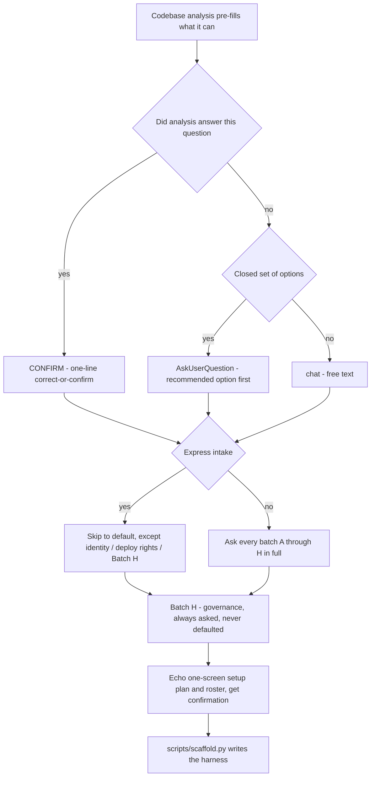
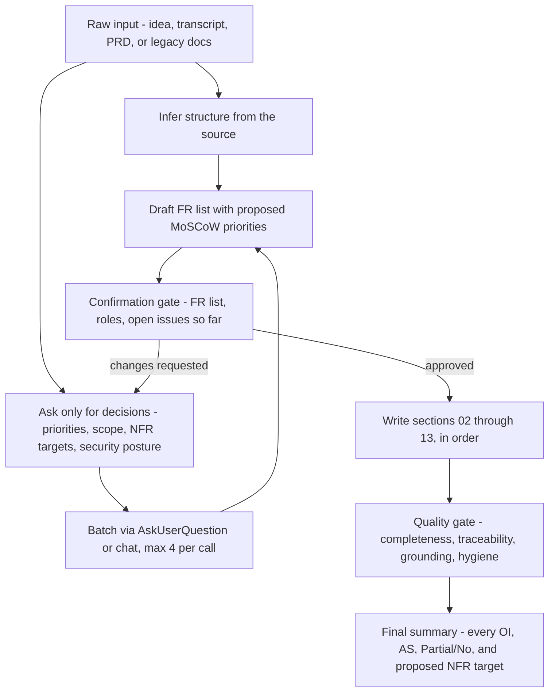

# Questionnaires

What each skill's question set actually explores, and why - so you know what you are being asked
before you are asked it. Full source: [`intake.md`](../harness-bootstrap/reference/intake.md) for
`harness-bootstrap`, [`elicitation.md`](../spec-builder/reference/elicitation.md) and
[`SKILL.md`](../spec-builder/SKILL.md) for `spec-builder`.

## `harness-bootstrap` intake

Codebase analysis runs first and pre-fills what it can. From there every question is one of two
kinds: a **confirmation** (analysis already found an answer - correct it or accept it in one line) or
a **real question** (nothing to infer from). Real questions are either closed-choice, through
`AskUserQuestion` (max 4 options, a recommended one labeled first), or open `chat` text when the
answer is a name, a number, or a policy position with no safe default. An **express path** ("use
defaults") skips straight to defaults for everything with one, printing the assumed table once for
confirmation - except project identity, the deploy-rights half of the control-level question, and
Batch H, which express mode never touches.

| Batch | Extracts | Why it matters |
|---|---|---|
| A - project identity | Name, domain, docs language, whether specs already exist, target AI tools | Sets the vocabulary for every generated file and which tool-specific output (Cursor, Codex) gets ported |
| B - tech stack | Language/framework, DB + ORM, integrations, environments and secrets, dev OS | Drives which rules load, the `db` flag, and which hook flavor - Windows or POSIX - actually fires |
| C - git and CI | Platform, commit identity, default branch, commit convention and scopes | Feeds the main-commit guard and the PR/MR terminology; a wrong identity misattributes commits |
| D - quality and safety | Test agent + frameworks, methodology (DDD default, TDD opt-in), data sensitivity, effort profile, control level | Sets the delivery discipline, the AI/PII guardrail strictness, and whether deploy rights sit in `deny` or `ask` |
| E - DB operations and seed | DB agent roster, seed policy, the real destructive DB command | Turns a reset command into an enforceable `permissions.deny` entry instead of a guess |
| F - branding and frontend | Brand assets, icon policy, accessibility target | Feeds `rules/frontend.md` and the a11y bar agents build against |
| G - audit mode | Repo scope, standards per repo, scanner strategy | Defines a read-only control plane's boundary; never eligible for express intake because scope cannot be guessed |
| H - governance | Model sovereignty per data class, residency, dependency licences, gated actions and incident contact | Policy positions only the org can hold - always asked in full, never defaulted, never guessed |

## `spec-builder` elicitation

These are BA questions, not intake questions: they clarify business facts a spec cannot invent -
priorities, permission scope, NFR targets, volumes, security posture. Everything else is inferred from
whatever the user brought (an idea, a transcript, a PRD, a codebase) and only the decisions are asked.
Questions batch by audience - scope, people, data and systems, constraints - through the same
`AskUserQuestion`/`chat` split as above, at most 4 per call. A user in a hurry can compress the
*pacing* (draft 01-05 before opening the next batch, combine batches the source already answers,
label a shallower first pass explicitly) but never the *content* - a business fact nobody stated is
never guessed, in any pace, at any speed.

| Question batch | Extracts | Why it matters |
|---|---|---|
| Scope | Purpose, must-have features, explicit non-goals, output language | Becomes the draft FR list section 02 onward is built from - a wrong list costs twelve documents |
| People | User groups, roles, who decides, who signs off | Role *names* can be inferred; permission *scope* (Own/Team/All) almost never can - it is asked, not guessed |
| Data and systems | Entities, volumes, integrations, identity provider | Feeds the data dictionary (08) and the integration NFRs (09); a volume guess is a design decision in disguise |
| Constraints | Security/compliance obligations, deadlines, budget, stack constraints | Section 07's security NFRs are mandatory and are never left "TBD" - an unanswered one becomes a named, owned open issue instead |

The one rule governing both skills the same way: an answer that can be inferred from what is already
there is inferred; an answer that is a decision, a priority, or a policy position is always asked, and
if nobody knows it, that gap is recorded - as an open issue with an owner, never as a plausible guess
standing in for the real answer.
