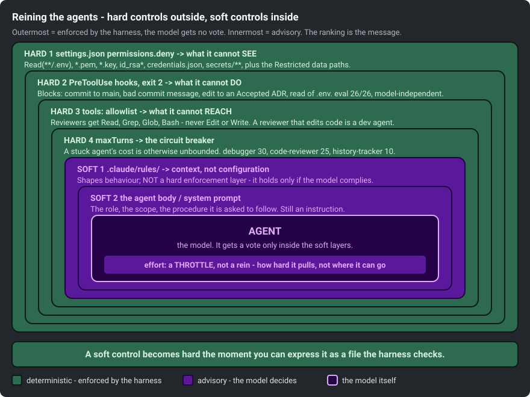
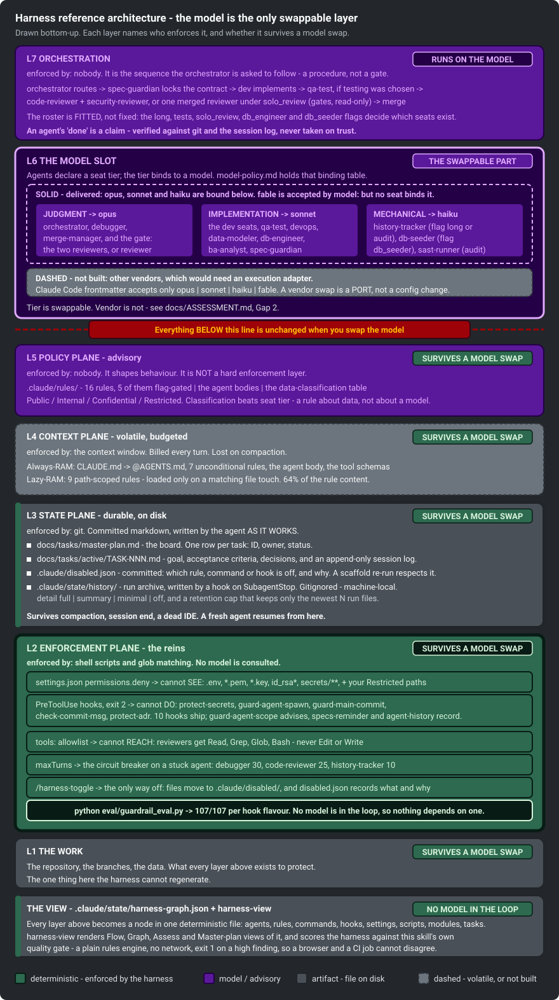

# Control surfaces, ranked by hardness

The distinction that matters is **enforced** versus **advisory**. This one-pager states which of the
harness's controls are which, citable from the quality gate and from `docs/CONTEXT-MANAGEMENT.md`.

## Enforced: the model does not get a vote

| Control | Where | What it stops |
|---|---|---|
| `permissions.deny` in `settings.json` | `Read(**/.env)`, `Read(**/*.pem)`, `Read(**/secrets/**)`, `Bash(git push --force:*)`, `Bash(rm -rf:*)`, plus a `{{RESTRICTED_DENIES}}` slot at the head of the list | What the agent cannot even **see**. The action never reaches a tool call |
| **PreToolUse hooks**, exit code 2 | `protect-secrets`, `guard-main-commit`, `check-commit-msg`, `protect-adr` | What the agent cannot **do**: read a `.env`, commit to `main`, ship a non-conventional commit message, edit an ADR whose on-disk status is `Accepted` |
| `tools:` allowlist in agent frontmatter | e.g. `code-reviewer` and `security-reviewer` get `Read, Grep, Glob, Bash` | What the agent cannot **reach**. A reviewer with `Edit` has stopped being a reviewer, and the frontmatter is what makes that structural rather than aspirational |
| `maxTurns` | e.g. `history-tracker: maxTurns: 10` | The circuit breaker. `cost-model.md`: *"the cost of a stuck agent is unbounded"* |

`eval/guardrail_eval.py` scaffolds a harness and fires the guardrail payload suite at it, both
must-block and must-allow cases, **all judged correctly**. The suite declares its own case count in
`CASES_PER_FLAVOR` and asserts it against the real one on every run, so the number lives there and
not in this sentence, where it went stale twice. Every block is a shell script and an exit code,
which is what the eval's header describes:

> `A cheap model cannot commit a secret. It cannot commit straight to main. It cannot edit an accepted
> ADR. It cannot ship an AI-attribution trailer. Not because it knows better, but because the hook
> exits 2 and the tool call never happens.`

Swap Opus for Haiku and the result is byte-identical. **The safety floor is model-independent.**

## Advisory

- **Rules in `.claude/rules/`.** Context, not configuration - Claude Code's own docs: rules *"shape
  Claude's behaviour but are not a hard enforcement layer"*. A good way to make an agent do the
  right thing; not a way to make the wrong thing impossible.
- **The agent body / system prompt.** Same category: instruction, which can be outweighed, forgotten
  after compaction, or simply not followed.
- **`effort:`** is a **throttle**, not a control. It sets how hard the model pulls, not where it is
  allowed to go. `cost-model.md`: *"Do not starve a judgment seat to save money."* Lowering `effort`
  on an agent you do not trust makes it a worse agent, not a safer one.
- **Hooks that cannot see who is calling them.** A hook is only as enforceable as the payload it
  fires on: `guard-agent-scope` wants to block a write to a module a different seat owns, but the
  `PreToolUse` payload for `Edit|Write` names no calling subagent, so it advises instead - see its
  header and `assets/claude/hooks/README.md` for the finding.

`agent-guardrails.md` builds this into a four-layer model and puts rules at layer 3 of 4: *"Rules are
layer 3 - they are not the only layer, and they are not a substitute for the other three."*

## Turning an advisory control into an enforced one

A soft control becomes hard when it can be expressed as a file the harness checks.

"Never commit to main" appears twice in this repo, deliberately: as prose in `AGENTS.md` (advisory)
and as `.claude/hooks/guard-main-commit.sh`, which parses the `Bash` call, resolves the target dir
from any `cd` or `git -C`, checks the effective branch, and **exits 2** (enforced). Only one is
enforced; the other exists so the agent knows why before it hits the wall.

The migration path is always the same: find the tool call the violation is shaped like, and
intercept it. `docs/ASSESSMENT.md` walks this move for data classification: `model-policy.md` says
which model may process which data class - advisory. The fix was not a better rule: Restricted data
lives at *known paths*, and `permissions.deny` on `Read(<those paths>)` means the agent never
obtains the data at all, so it cannot leak it to any model on any provider, regardless of which
model is driving or whether it read the rule.

## What could not be made hard

- **Model routing is still advisory.** Nothing prevents an agent from putting Confidential-but-readable
  text into a prompt to a model the policy table does not permit. The reason generalises: *"There is no
  tool call shaped like 'sent this text to that provider', so there is nothing for a hook to
  intercept."* A control surface needs a surface. Where there is no interceptable event, there is no
  hook.
- **Data the org cannot locate.** If Restricted material has no nameable path, the deny list cannot
  cover it and the classification table is advice. The intake forces that admission rather than letting
  it pass silently - *"but an admission is not a control."*

From `ASSESSMENT.md`: **this repo enforces model sovereignty at the data boundary, and governs it by
rule everywhere else.**

## The model as a layer

The memory hierarchy (`docs/CONTEXT-MANAGEMENT.md`, section 1) and the control ranking above are two
views of the same stack.

Read it bottom-up: the work at the bottom, everything above it protecting it. The enforcement plane
is the thickest band because it is the only one that does not negotiate - shell scripts and glob
matching, no model consulted. Above it: the state plane (markdown in git), the context plane (the
volatile window `docs/CONTEXT-MANAGEMENT.md` is about), the policy plane (advice). Only then the
**model**, in a slot near the top, with the seat-tier bindings (`judgment -> opus`,
`implementation -> sonnet`, `mechanical -> haiku`) drawn as replaceable contents, not structure.

**Every layer beneath the slot is model-agnostic.** Swap the tier bindings and the deny list, hooks,
tool grants, `maxTurns`, board, task files, and run archive are byte-for-byte what they were. The
safety floor and the durable state sit underneath the model choice, not on top of it.

The diagram carries the caveat from `docs/ASSESSMENT.md` Gap 2: **model tier is swappable; model
vendor is not.** `model:` accepts `opus | sonnet | haiku | fable` and nothing else, so re-pointing
the roster at a self-hosted or third-party model is a **port**, not a config change - there is no
execution adapter here. Nor is the tier table a *generator*: each agent file still names its own
`model:`, so a tier swap today is a table edit AND a frontmatter sweep. Generating `model:` from the
tier at scaffold time is listed as outstanding work, and it is not done.

## Sources

`assets/claude/settings.json` (deny rules) · `assets/claude/hooks/` + `hooks/README.md` (the
PreToolUse hooks and contract) · `assets/claude/rules/agent-guardrails.md` (the four-layer model) ·
`assets/claude/rules/model-policy.md` (the data-classification table) · `eval/guardrail_eval.py`
(the payload suite) · `docs/ASSESSMENT.md` (enforced vs advisory, and why model routing cannot be
hooked) · `docs/CONTEXT-MANAGEMENT.md` (the memory hierarchy this ranking sits alongside).
