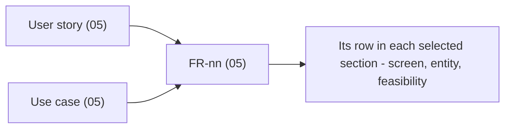

# Specifications - {{PROJECT_NAME}}

{{PROJECT_PURPOSE}}

This directory is the requirements contract for {{PROJECT_NAME}}. Code that disagrees with a section
here is either a bug or an undocumented decision; find out which. Nothing in these documents is
invented - anything not stated by a stakeholder or clearly implied by source material lives in
[11-assumptions-constraints.md](11-assumptions-constraints.md) as an open issue with an ID.

## Contents

| # | Section | What it answers |
|---|---------|-----------------|
| 01 | [Overview](01-overview.md) | Why the system exists, what is in and out of scope, how success is measured |
{{#IF_STAKEHOLDERS}}| 02 | [Stakeholders](02-stakeholders.md) | Who cares, who decides, who is affected |
{{/IF_STAKEHOLDERS}}| 03 | [Glossary](03-glossary.md) | The domain vocabulary - one term, one meaning |
{{#IF_FLOWS}}| 04 | [Business flows](04-business-flows.md) | How work moves through the system end to end |
{{/IF_FLOWS}}| 05 | [Functional requirements](05-functional-requirements.md) | What the system must do (FR-nn), plus use cases and user stories |
{{#IF_ACCESS}}| 06 | [Access control](06-access-control.md) | Roles and the permission matrix |
{{/IF_ACCESS}}| 07 | [Non-functional requirements](07-non-functional-requirements.md) | Performance, security, reliability, usability, scalability |
{{#IF_DB}}| 08 | [Data model](08-data-model.md) | Entities, relationships, and the data dictionary |
{{/IF_DB}}{{#IF_INTEGRATION}}| 09 | [Integration interface](09-integration-interface.md) | External systems, protocols, and auth |
{{/IF_INTEGRATION}}{{#IF_UI}}| 10 | [UI/UX wireframes](10-ui-ux-wireframes.md) | Screens, and the requirements each one serves |
{{/IF_UI}}| 11 | [Assumptions and constraints](11-assumptions-constraints.md) | What we assumed, what binds us, what is still open |
{{#IF_FEASIBILITY}}| 12 | [Technical feasibility](12-technical-feasibility.md) | Can each requirement actually be built, and at what risk |
{{/IF_FEASIBILITY}}| 13 | [Revision history](13-revision-history.md) | What changed, when, and by whom |
{{#IF_DESIGN}}| 14 | [Design system](14-design-system.md) | Optional appendix - tokens, components, and brand assets |
{{/IF_DESIGN}}
Not every project carries every section: the core (README, 01, 03, 05, 07, 11, 13) always exists;
the rest were selected against the input material when this set was created. A number missing from
the table above was deliberately not selected - it can be added later by re-running the scaffolder.
A section that outgrew one file is a folder of the same name with a `README.md` index inside.

## Reading guide

- **New to the project**: 01, then 03, then 04. Twenty minutes gets you the shape of the domain.
- **Building a feature**: 05 for the FR, 06 for who may call it, 08 for the entities it touches,
  10 for the screen. The FR is the entry point; everything else links back to it.
- **Reviewing scope or cost**: 01 (scope), 12 (feasibility), 11 (open issues). Every "No" or
  "Partial" in 12 is a scope conversation waiting to happen.
- **Security review**: 06 and 07. The security NFRs are mandatory and are never "TBD".

## ID schemes

| Prefix | Lives in | Example |
|--------|----------|---------|
| `FR-nn` | 05 | `FR-01`, anchored `{#fr-01}` |
| `NFR-XXX-nn` | 07 | `NFR-SEC-01`, `NFR-PERF-02` |
| `UC-xx` | 05 | `UC-01` |
| `US-xx` | 05 | `US-01` |
| `BR-xx` | 05 | `BR-01` |
| `AS-xx` | 11 | `AS-01` (assumption) |
| `OI-xx` | 11 | `OI-01` (open issue), anchored `{#oi-01}` |
| `CO-xx` | 11 | `CO-01` (constraint) |
| `DP-xx` | 11 | `DP-01` (dependency) |
| `R-xx` | 12 | `R-01` (risk) |
| `BF-xx` | 04 | `BF-01` (business flow) |
| `SCR-xx` | 10 | `SCR-01` (screen) |
| `INT-xx` | 09 | `INT-01` (integration) |
| `SH-xx` | 02 | `SH-01` (stakeholder) |
| `DS-xx` | 14 | `DS-01` (design-system component) |
| `DT-xx` | 14 | `DT-01` (design token) |

IDs are stable. A requirement that is dropped keeps its ID and is marked withdrawn; it is never
reused, because a task, a commit, and a test somewhere still name it.

Every prefix above also accepts a module segment, and one is **required** for any ID defined under
`modules/<module>/`: `FR-BLG-01`, `UC-PAY-03`, `NFR-BLG-SEC-01` (module first, then the NFR
category). Two modules that each define a bare `FR-01` collapse into one node in the traceability
graph, silently - the segment is what keeps them apart. A single-product spec set stays flat.

## Traceability

Every functional requirement is reachable from five directions, and each link is a relative path,
anchored wherever the target carries one:

When 12 is selected, an FR missing from it is a broken set; when 10 is selected, a screen serving
no FR is the same defect. Fix either before review.

<!-- Authoring: keep this README last-updated by hand. Do not add a generated-on date; these files
     are prompt-cache prefix content and one volatile byte cold-misses the cache downstream. -->
